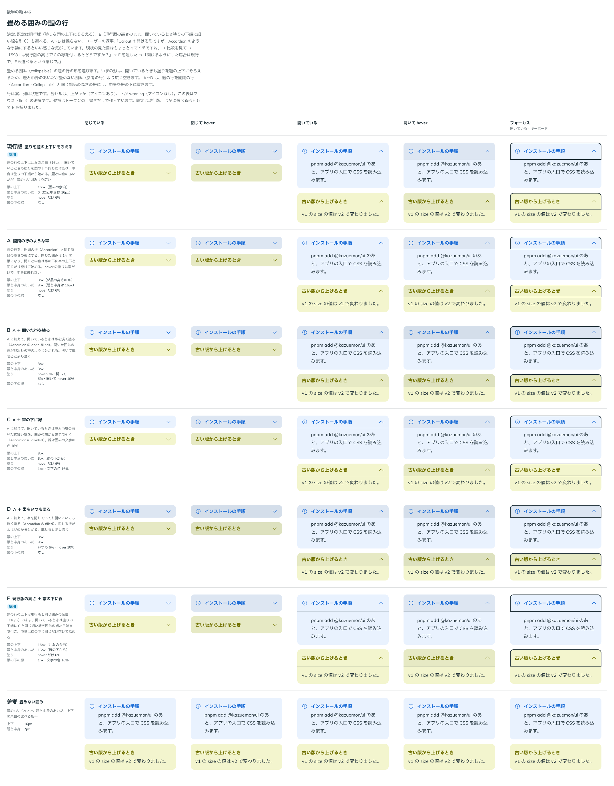

# 0472. 畳める Callout の題の行は、塗りを題の上下にそろえる形が既定。開いた帯の下に線を引く形も選べる

- ステータス: Accepted
- 日付: 2026-10-03
- ラウンド: 後半 軸 446

## 背景

[ADR-0410](./0410-callout-collapsible.md) で、畳める Callout は開いているときも塗りを題の上下にそろえる形にしました。そのぶん題と中身のあいだが、畳めない囲みより広く空きます。ユーザーが、開閉の行（Accordion）のような形にできないか、いまの見た目は物足りない、と言ったため、題の行の形を比べました。

## 候補

比較は、決めた時点のコミット `736b398` の比較のストーリー（`design/stories/axis-446-callout-collapsible-row.stories.tsx`）です。

| 案             | 題の行の上下   | 開いたときの帯       |
| -------------- | -------------- | -------------------- |
| 現行版（既定） | 囲みの余白     | 変わらない           |
| A              | 部品の高さの帯 | 変わらない           |
| B              | 部品の高さの帯 | 淡く塗る             |
| C              | 部品の高さの帯 | 下に細い線           |
| D              | 部品の高さの帯 | 閉じていても淡く塗る |
| E（選べる形）  | 囲みの余白     | 塗りの下端に細い線   |

## 決定

**既定は現行版のままにし、E も選べるようにします。** E は、題の行の高さを現行版のまま、開いているときだけ塗りの下端に細い線（囲みの文字の色 16%、1px）を囲みの端から端まで引き、中身は線の下に、帯の上下と同じだけ空けて始めます。`showDivider` で選びます。A〜D は採りません。

- 0410 の決定（印は右端・載せたときの塗りは 6%・開いているときも塗りを題の上下にそろえる）は、既定として残ります
- `showDivider` は `collapsible` のときだけ効き、既定は線なしです

## 理由

ユーザーの返事の原文です。

> Callout の開ける形ですが、Accordion のような挙動にするといい感じな気がしています。現状の見た目はちょっとイマイチですね

比較を見たあと:

> 5981 は現行版の高さでCの線を付けるとどうですか？

E を足したあと:

> 開けるようにした場合は現行で、Eも選べるという感じで。

## 却下した案と理由

A〜D は、題の行を開閉の行と同じ高さの帯にする案です。閉じた囲みの高さが変わる割に、現行版との違いが小さいため、採りませんでした。線だけを足す E で、題と中身の分かれ方は選べます。

## 影響

- `src/components/callout/Callout.tsx`: `showDivider` を足しました
- 比べるためだけに足した `--callout-row-band`・`--callout-row-gap`・`--callout-row-fill-*`・`--callout-row-rule-width` は畳んで消しました。残るのは hover の塗りと線の色の `--callout-row-fill-hover-mix`・`--callout-row-rule-mix` です
- Callout のストーリーに、線の見本（`CollapsibleDivider`、visual）を足しました
- 比較のストーリーは消しました

## 原則への反映

反映なし。開いたときに題と中身を線で分けて選べるようにする決定で、原則の文は変わりません。細い線で面を分ける考えの範囲内です。

## 比較画像

決めた時点のコミットは、比較が `736b398`、実装が `fad892a` です。`git checkout 736b398 && pnpm storybook` で、比較のストーリー（`Design Review/446 畳める囲みの題の行`）を決めたときの部品のまま開けます。
