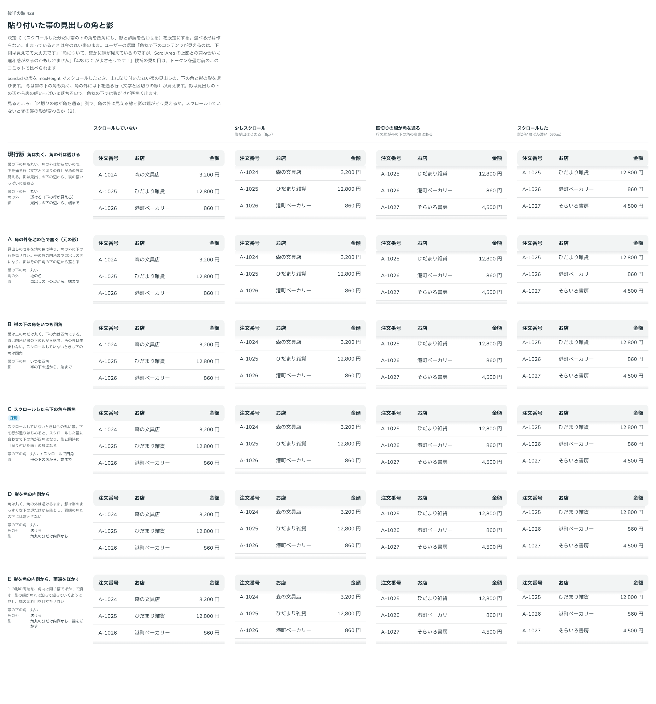

# 0473. banded の貼り付いた見出しの帯は、スクロールした分だけ下の角を四角にし、影と合わせる

- ステータス: Accepted（[ADR-0347](./0347-data-table-sticky-edge.md) の「banded の角丸の外に下の行が透けない」を置き換える）
- 日付: 2026-10-04
- ラウンド: 後半 軸 428

## 背景

DataTable の `banded`（丸い見出しの帯）に `maxHeight` を渡してスクロールすると、見出しの帯が上に貼り付き、下を行が通ります。[ADR-0347](./0347-data-table-sticky-edge.md) では、帯を `th::before` に描き、`th` を地の色で塗って、帯の角丸の外に下の行が透けないようにしていました。

レビューで、角の外は透けてよいと分かり、`th` を塗らない形に直しました。すると、角の外に下の行の区切りの線が見え、影は見出しの下の辺から表の幅いっぱいに落ちるので、角丸の下では影だけが四角く出ます。この角と影の組み合わせを比べました。

## 候補

比較は、決めた時点のコミット `2ffbd89` の比較のストーリー（`design/stories/axis-428-data-table-banded-sticky-corner.stories.tsx`）です。列は「スクロールしていない・少しスクロール・区切りの線が角を通る・スクロールした」です。

| 案          | 帯の下の角                      | 角の外 | 影                                 |
| ----------- | ------------------------------- | ------ | ---------------------------------- |
| 現行版      | 丸い                            | 透ける | 見出しの下の辺から、端まで         |
| A（元の形） | 丸い                            | 地の色 | 見出しの下の辺から、端まで         |
| B           | いつも四角                      | なし   | 帯の下の辺から、端まで             |
| C（採用）   | 丸い → スクロールした分だけ四角 | なし   | 帯の下の辺から、端まで             |
| D           | 丸い                            | 透ける | 角丸の分だけ内側から               |
| E           | 丸い                            | 透ける | 角丸の分だけ内側から、両端をぼかす |

## 決定

**C にします。** 選べる形は作りません。

- 止まっているときは、今と同じ上下とも丸い帯です
- スクロールすると、帯の下の角は、影の濃さと同じ量（スクロールした量、`--cue-top`）で丸から四角へ変わります。影が濃くなりきるころには、帯は下の辺がまっすぐな「貼り付いた面」の形になり、影はその下の辺から表の幅いっぱいに落ちます
- `th` そのものは塗りません

## 理由

ユーザーの返事の原文です。

> 角丸で下のコンテンツが見えるのは、下側は見えてて大丈夫です

> 角について、確かに線が見えているのですが、ScrollArea の上影との兼ね合いに違和感があるのかもしれません

> 428 は C がよさそうです！

違和感は、角の外に見える線そのものより、四角く落ちる影と丸い角の食い違いにありました。C は、影が出るのに合わせて帯の下の辺をまっすぐにするので、影の形と帯の形がそろいます。スクロールしていないときの丸い帯は変えずに済みます。

## 却下した案と理由

- **A（角の外を地の色で塞ぐ）**: 角の外が透けるのはかまわない、という返事でした。帯の外の四角まで見出しの面になり、帯の形が崩れます
- **B（下の角をいつも四角）**: スクロールしていないときも帯の形が変わります
- **D・E（影を角の内側から）**: 影の端が途中で切れ、`ScrollArea` の上の端の影（端まで落ちる）とそろいません

## 影響

- `src/components/data-table/DataTable.tsx`: `banded` の帯（`th::before`）の下の角丸を `calc(var(--radius-control) * (1 - var(--cue-top, 0)))` にしました。上の角は `rounded-ss-control`・`rounded-se-control` のままです
- `design/tokens.css`: 比べるためだけのトークン（`--data-table-banded-head-corner-fill`・`--data-table-banded-head-square`・`--data-table-banded-head-square-scrolled`・`--data-table-banded-shadow-inset`・`--data-table-banded-shadow-taper`）を畳んで消しました
- `src/components/data-table/DataTable.stories.tsx`: 「高さの上限と固定した見出し」の基準画像を撮り直し、play で、スクロールしたあと帯の下の角が四角く、上の角が丸いことを確かめます
- 比較のストーリーは消しました

## 原則への反映

反映なし。原則1「ページの一部でも、画面に貼り付いて、スクロールした内容が下を通るようになったら、重なりとして扱います」の通りです。重なりになった分だけ、影と面の形をそろえます。

## 比較画像

決めた時点のコミットは `2ffbd89`（比較）・`d34e4cd`（実装）です。`git checkout 2ffbd89 && pnpm storybook` で、比較のストーリー（`Design Review/428 貼り付いた帯の見出しの角と影`）を決めたときの部品のまま開けます。
