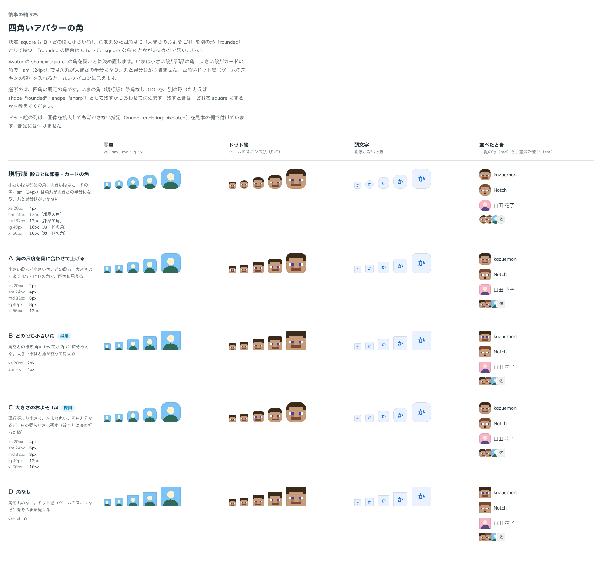

# 0474. Avatar の四角は 2 つ。square は大きさのおよそ 1/4 の角、tile はどの段も小さい角

- ステータス: Accepted（[ADR-0154](./0154-avatar-shape.md) の「四角の角は小さい段が部品の角、大きい段がカードの角」を置き換える）
- 日付: 2026-10-06
- ラウンド: 後半 軸 525

## 背景

hane（大会運営のアプリ）から、Avatar の `shape="square"` が sm・md では丸に見えるという報告がありました。四角の角は、小さい段（sm・md）が部品の角（12px）、大きい段（lg・xl）がカードの角（16px）で、sm（24px）では角丸が大きさの半分になり、丸と見分けがつきません。ゲームのスキンの頭（8×8 のドット絵）を入れると、丸いアイコンに見えます。hane は、スキンの部品で角を 4px に上書きしていました。

段ごとの四角の角を比べました。比較は、決めた時点のコミット `b9ab215` の比較のストーリー（`design/stories/axis-525-avatar-square-radius.stories.tsx`）です。列は写真・ドット絵・頭文字・並べたとき（一覧の行と重ねた並び）です。

## 候補

| 案          | xs / sm / md / lg / xl  |
| ----------- | ----------------------- |
| 現行版      | 4 / 12 / 12 / 16 / 16px |
| A           | 2 / 4 / 6 / 8 / 12px    |
| B（tile）   | 2 / 4 / 4 / 4 / 4px     |
| C（square） | 4 / 6 / 8 / 12 / 16px   |
| D           | 0（角なし）             |

## 決定

**角を丸めた四角は C、角の小さい四角は B にし、2 つの形として持ちます。値の名前は、C を `square`、B を `tile` にします。** `shape` は `circle`（既定）・`square`・`tile` です。角は段ごとに決め打った値で、高さに比例させる規則ではありません（原則 5）。

## 理由

ユーザーの返事の原文です。

> rounded の場合は C にして、square なら B とかがいいかなと思いました。

値の名前は、はじめ「square（B）・rounded（C）」で考えました。ところが props の語彙では、ボタン・リンク・Pagination の `shape="square"` は部品の角の、角を丸めた四角です。Avatar だけ `square` を角の小さい四角にすると、意味がずれます。そこで、角を丸めた四角（C）を `square` にそろえ、角の小さい四角（B）に新しい値 `tile` を足す案を選びました。

> a がよさそう。書き換えるで OK です。

- **2 つ持つ理由**: 写真や頭文字には角の柔らかい四角が合い、ドット絵やロゴのように四角く見せたい画像には角の立った四角が合います。どちらも使う場面があります
- **C を square にした理由**: 大きさのおよそ 1/4 の角は、ボタンの square（部品の角）と見た目の性格が近く、ライブラリの中で「square = 角を丸めた四角」がそろいます。今の square からの見た目の変化も小さくなります

## 却下した案と理由

- A: B と C のあいだで、どちらの用途にも寄らない
- D（角なし）: 角を丸めない四角は、ほかの部品にない形です。ドット絵は B の小さい角で十分に四角く見えます
- 値の名前を `square`・`rounded` にする案: ボタンの `square` と意味がずれる
- 角の大きさを別の props（`corner`）にする案: `square` のときしか効かない props になり、語彙が増える
- `squircle`: よく通じる語だが、滑らかな曲線の形とは違い、ボタンの `square` とずれる点も残る

## 影響

- `src/components/avatar/Avatar.tsx`: `shape` に `tile` を足し、四角の角を段ごとに決め打ちました（角の尺度を直接指します）。根の要素に `data-shape` を付けました（Tag・Chip が形を見分けるため）
- `design/props.md`: `shape` の値に、Avatar だけの `tile` を足しました
- 実装のコミット `858415c` で、比べるためだけに置いたものを畳みました。比較のストーリーは消しました
- hane は、スキンの部品の角の上書きをやめ、`shape="tile"` に書き換えます

## 原則への反映

反映なし。段ごとに決め打った角で、原則 5 の文は変わりません。

## 比較画像

