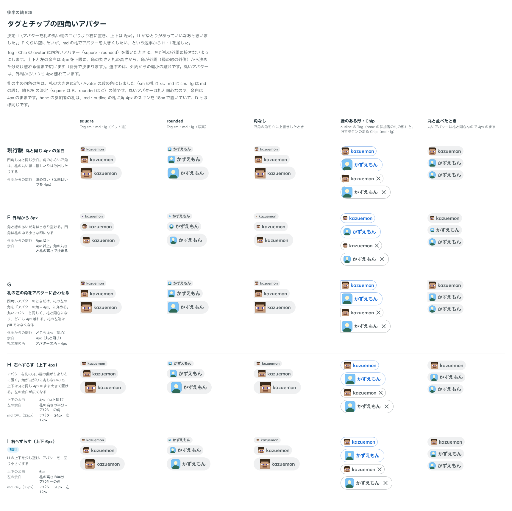

# 0475. Tag・Chip の四角いアバターは、上下を 6px 空け、丸い端の曲がりより右に置く

- ステータス: Accepted（[ADR-0400](./0400-tag-avatar.md) の「上下と左に 4px」を、四角いアバターについて置き換える）
- 日付: 2026-10-06
- ラウンド: 後半 軸 526

## 背景

hane から、Tag の `avatar` に四角いスキン（ドット絵）を入れると、既定の余白（4px）ではスキンの角が札の丸い縁にかかって欠けて見える、という報告がありました。hane は、余白のトークンを札の上で 7px に上書きしていました。

丸いアバターは札（pill）と同心なので、どこも外周から同じだけ離れます。四角いアバターは、角が札の丸い端に近づきます。四角いアバターの置き方を比べました。比較は、決めた時点のコミット `b9ab215` の比較のストーリー（`design/stories/axis-526-small-parts-square-avatar.stories.tsx`）です。列は四角（ドット絵）・角を丸めた四角（写真）・角なし・縁のある形と Chip・丸と並べたときです。

途中で、札の中の四角の角を、アバターの段ではなく札の大きさで決めるようにしました（sm の札は xs、md の札は sm、lg の札は md の段の角）。札の中ではアバターが段より小さく描かれるので、段の角のままでは sm の札で丸に近く見えたためです。

## 候補

1 回目は「角が札の外周から決めた分だけ離れるまで、上下と左の余白を広げる」形で、離れの量（2・3・4・5px）を比べました。返事を受けて、2 回目は次の案を比べました。

| 案        | 内容                                                           | sm・md・lg の札のアバター  |
| --------- | -------------------------------------------------------------- | -------------------------- |
| 現行版    | 丸と同じ 4px の余白                                            | 12・24・36px（角がかかる） |
| F         | 外周からどこも 8px 離れるまで余白を広げる                      | 4・14・22px                |
| G         | 札の左の角を「アバターの角 + 4px」に丸め、アバターと同心にする | 12・24・36px               |
| H         | 丸い端の曲がりより右に置く。上下は 4px                         | 12・24・36px               |
| I（採用） | 丸い端の曲がりより右に置く。上下は 6px                         | 8・20・32px                |

## 決定

**I を採ります。** 四角いアバター（`square`・`tile`）は、上下の余白を 6px にし、左の余白を「札の高さの半分 − アバターの角」にします。アバターの角の丸みの中心が、札の丸い端の中心の真下に来るので、角が丸い端の曲がりに寄りません。丸いアバターは今のまま（上下と左に 4px）です。

## 理由

ユーザーの返事の原文です。1 回目（離れ 2〜5px）を見て、次の返事でした。

> まだ近い気がしますね

離れを 6・8px にした案と、札の角を合わせる案（G）を見て、次の返事でした。

> F くらいあけたいなあという気持ちになりつつ、F の中くらいの時のアバターサイズを上げられますか？

外周からどこも 8px 離すと、md の札（32px）のアバターは最大でも 16px です。そこで、丸い端の曲がりから離しつつ上下を詰める H・I を足しました。

> I がゆとりがあっていいなあと思いました。

## 却下した案と理由

- 現行版: 角が札の丸い縁にかかる
- 外周からの離れを決めて余白を広げる案（離れ 2〜8px）: 近く見えるか、離すとアバターが小さくなりすぎる
- G: 札の左端が pill でなくなり、小物は pill という形（原則 5）から外れる
- H: 上下が丸と同じ 4px で、I よりゆとりがない

## 影響

- `src/internal/small-parts-leading.ts`: Tag・Chip の根に付ける `smallPartsAvatarClass` を足しました。札の中のアバターの角と、上下・左の余白を決めます
- `src/internal/small-parts-size.ts`: 札の大きさの段ごとに、札の中の四角の角（`--small-parts-avatar-radius-square`・`-tile`）を置きました
- `src/internal/small-parts.tokens.css`: `--small-parts-avatar-inset-square`（6px）を足しました
- 実装のコミット `858415c` で、比べるためだけに置いたトークン（外周からの離れ・同心・右へずらす）を畳みました。比較のストーリーは消しました
- hane は、Tag の余白の上書き（`--small-parts-avatar-inset`）を外せます

## 原則への反映

原則 5 の「何かの内側に収めるものの角は、外側の角から余白を引いた同心の角です」を、中身が自分の形を持つときの置き方まで含めた文に書き換えました。

## 比較画像

