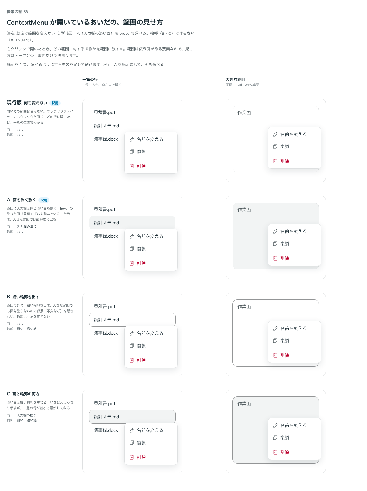

# 0476. ContextMenu は、開いているあいだ範囲を変えない。入力欄の淡い面を敷くのは highlightArea で選べる

- ステータス: Accepted
- 日付: 2026-10-07
- ラウンド: 第 1 波 軸 531（ContextMenu）
- 決めた時点のコミット: `072dcede`（`git checkout 072dcede && pnpm storybook` で、決めたときの部品のまま比較を開けます）

## 背景

ContextMenu は、`trigger` を当てた範囲（写真・一覧の行・エディタなど）の右クリックで一覧を開きます。開いているあいだ、どの範囲に開いたかを範囲の側で見せるかを比べました。

比較のストーリーは `design/stories/axis-531-context-menu-area.stories.tsx` でした（決めたあとに消しました）。

## 候補

| 案     | 内容                                                 |
| ------ | ---------------------------------------------------- |
| 現行版 | 何も変えない。ブラウザやファイラーの右クリックと同じ |
| A      | 範囲に入力欄の淡い面を敷く                           |
| B      | 範囲の外に細い輪郭を出す                             |
| C      | 淡い面と細い輪郭の両方                               |

## 決定

**既定は現行版（範囲を変えない）です。** 範囲に入力欄の淡い面を敷く A は、`highlightArea` で選べます。輪郭（B・C）は作りません。

## 理由

ユーザーの返事の原文です。

> デフォルトは現行版で、利用者が欲しい場合は A のようにできる、がよさそうです。

## 却下した案と理由

- B・C（輪郭）: 大きな範囲や写真では輪郭が騒がしく、範囲の寸法の外に線が出る。作らない

## 影響

- `src/components/context-menu/ContextMenu.tsx`: `highlightArea`（既定 `false`）を足しました。`true` のとき、開いているあいだ範囲に入力欄の塗り（`bg-field`）を敷きます。開いているかは Root に渡す開閉の値から決めます（Base UI が付ける `data-popup-open` は、`defaultOpen`・`open` で開いたときに付かないため）
- 比べるためだけに置いた範囲の面・輪郭のトークンは畳みました。比較のストーリーは消しました

## 原則への反映

反映なし。原則の文は変えていません。

## 比較画像

