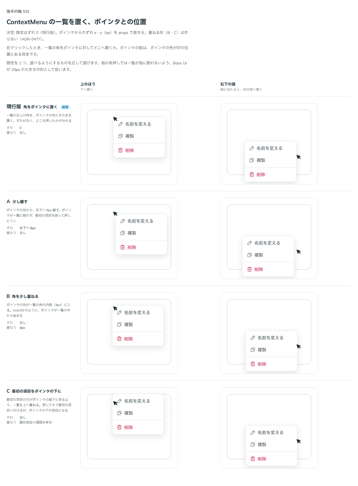

# 0477. ContextMenu の一覧は、ポインタの先に角を置く。ずらすのは offsetX・offsetY で渡す

- ステータス: Accepted
- 日付: 2026-10-07
- ラウンド: 第 1 波 軸 532（ContextMenu）
- 決めた時点のコミット: `072dcede`（`git checkout 072dcede && pnpm storybook` で、決めたときの部品のまま比較を開けます）

## 背景

右クリックで開く一覧を、ポインタのどこに出すかを比べました。ポインタが一覧に隠れるか、最初の項目を誤って押さないかが分かれ目です。

比較のストーリーは `design/stories/axis-532-context-menu-offset.stories.tsx` でした（決めたあとに消しました）。

## 候補

| 案     | 内容                                         |
| ------ | -------------------------------------------- |
| 現行版 | 一覧の左上の角を、ポインタの先にそのまま置く |
| A      | 右下へ 8px 離す                              |
| B      | 角を 4px 重ねる                              |
| C      | 最初の項目をポインタの真下に重ねる           |

## 決定

**既定は現行版（ずれなし）です。** 利用者は `offsetX`・`offsetY`（px）でずらせます。重ねる案（B・C）は作りません。

## 理由

ユーザーの返事の原文です。

> デフォルトは現行版で、利用者が offsetXY を指定できるとかでも良さそうです。

## 却下した案と理由

- A を既定にする: 離す量は使う場面で変わるので、既定では決めない
- B・C（重ねる）: ポインタの下が項目になり、押してすぐ最初の項目に行ってしまう。重ねるためのトークンは畳んだ

## 影響

- `src/components/context-menu/ContextMenu.tsx`: `offsetX`・`offsetY`（既定 0）を足しました。Base UI の位置の `offset`（`side`・`align` の軸）に渡します
- 比べるためだけに置いた重ねる量のトークンは畳みました。比較のストーリーは消しました

## 原則への反映

反映なし。原則の文は変えていません。

## 比較画像

