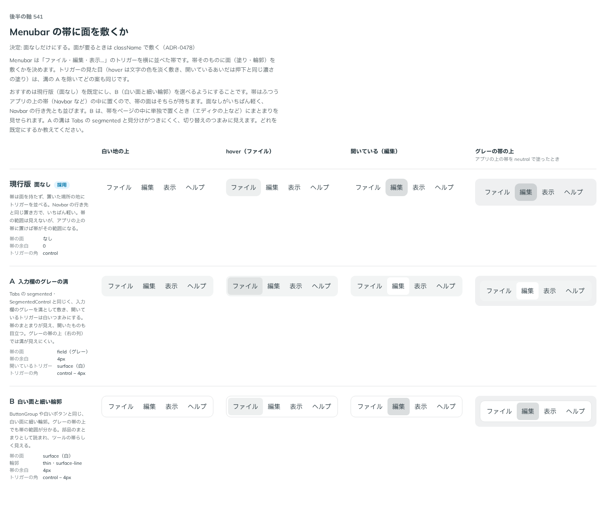

# 0478. Menubar の帯は面を持たない。面が要るときは使う側が敷く

- ステータス: Accepted
- 日付: 2026-10-07
- ラウンド: 第 1 波 軸 541（Menubar）
- 決めた時点のコミット: `b0ff049d`（`git checkout b0ff049d && pnpm storybook` で、決めたときの部品のまま比較を開けます）

## 背景

Menubar は、アプリの上の帯にメニューのトリガーを並べる部品です。帯そのものに面（塗り・輪郭）を持たせるかを比べました。

比較のストーリーは `design/stories/axis-541-menubar-surface.stories.tsx` でした（決めたあとに消しました）。

## 候補

| 案     | 内容                                                           |
| ------ | -------------------------------------------------------------- |
| 現行版 | 面なし。置いた場所の地にトリガーを並べる                       |
| A      | 入力欄のグレーの溝を敷き、開いているトリガーを白いつまみにする |
| B      | 白い面と細い輪郭                                               |

## 決定

**面なしだけにします。** 帯の面を選ぶ props は作りません。Docs には「面が要るときは `className` で敷く」と書きます。

## 理由

ユーザーの返事の原文です。

> 必要ならユーザーに帯を引いてもらう前提で、現行版のみでいいかなと思いました。（全幅に敷きたい などのニーズを拾いきれなさそう）

## 却下した案と理由

- A・B: 全幅に敷く・帯の上下の線だけ引くなど、使う側の必要を面の props では拾いきれない

## 影響

- `src/components/menubar/Menubar.tsx`: 帯は塗り・輪郭・余白を持ちません
- 帯の面のトークンは畳みました。比較のストーリーは消しました

## 原則への反映

反映なし。原則の文は変えていません。

## 比較画像

