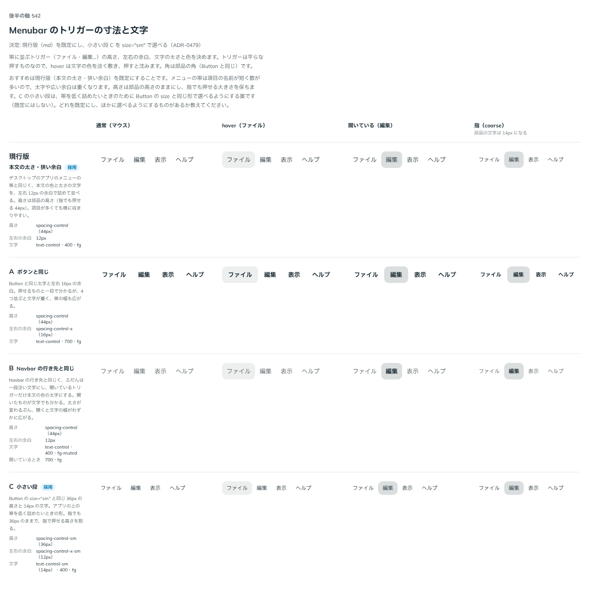

# 0479. Menubar のトリガーは本文の太さ・左右 12px が既定。size="sm" で 36px の小さい段にできる

- ステータス: Accepted
- 日付: 2026-10-07
- ラウンド: 第 1 波 軸 542（Menubar）
- 決めた時点のコミット: `b0ff049d`（`git checkout b0ff049d && pnpm storybook` で、決めたときの部品のまま比較を開けます）

## 背景

トリガーの高さ・余白・文字の太さを比べました。デスクトップのアプリのメニューの帯に近づけるか、Button に近づけるかが分かれ目です。

比較のストーリーは `design/stories/axis-542-menubar-trigger.stories.tsx` でした（決めたあとに消しました）。

## 候補

| 案     | 内容                                                              |
| ------ | ----------------------------------------------------------------- |
| 現行版 | 本文の太さ・左右 12px・高さ 44px                                  |
| A      | Button と同じ太字・左右 16px                                      |
| B      | ふだんは淡い文字、開いているものだけ太字（Navbar の行き先と同じ） |
| C      | 小さい段（36px・14px の文字）                                     |

## 決定

**既定は現行版です。** `size` を足し、`md`（既定）に加えて `sm`（C: Button の `size="sm"` と同じ高さ・文字・左右の余白）を選べます。

## 理由

ユーザーの返事の原文です。

> デフォルトは現行版で、サイズを小さくできるでも良さそうかなと思いました。

## 却下した案と理由

- A: 4 つ並ぶと文字が重く、帯の幅も広がる
- B: 開くと太さが変わり、文字の幅が動く

## 影響

- `src/components/menubar/Menubar.tsx`: `size`（`md`・`sm`、既定 `md`）を足しました
- 比べるためだけに置いたトリガーの寸法・文字のトークンは畳みました。比較のストーリーは消しました

## 原則への反映

反映なし。原則の文は変えていません。

## 比較画像

