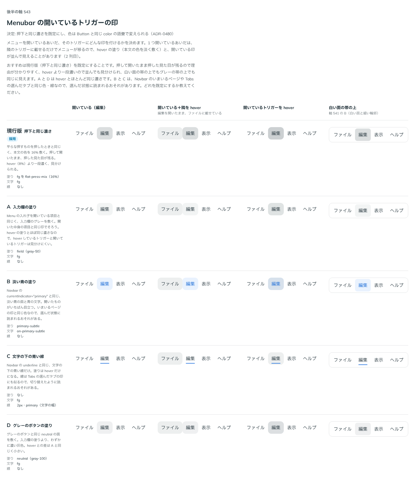

# 0480. Menubar の開いているトリガーは、押下と同じ濃さを敷く。色は Button と同じ color で変えられる

- ステータス: Accepted
- 日付: 2026-10-07
- ラウンド: 第 1 波 軸 543（Menubar）
- 決めた時点のコミット: `b0ff049d`（`git checkout b0ff049d && pnpm storybook` で、決めたときの部品のまま比較を開けます）

## 背景

メニューを開いているあいだ、そのトリガーにどんな印を残すかを比べました。

比較のストーリーは `design/stories/axis-543-menubar-open-trigger.stories.tsx` でした（決めたあとに消しました）。

## 候補

| 案     | 内容                             |
| ------ | -------------------------------- |
| 現行版 | 押下と同じ濃さ（本文の色を 16%） |
| A      | 入力欄の塗り                     |
| B      | 淡い青の塗りと青い文字           |
| C      | 文字の下の青い線                 |
| D      | グレーのボタンの塗り             |

## 決定

**既定は現行版（押下と同じ濃さ）です。** 敷く色は、Button と同じ `color` の語彙で変えられます（`primary` など。`white` は取りません）。

## 理由

ユーザーの返事の原文です。

> ボタンと同じ役割だと思うので現行版にしつつ、primary など色を変えられるでいいかなと思いました。

## 却下した案と理由

- A・D: hover の塗りとの差が小さく、hover しているトリガーと見分けにくい
- B・C: いまいるページ・選んだタブの印と同じ形で、選んだ状態に読まれるおそれがある

## 影響

- `src/components/menubar/Menubar.tsx`: `color`（Button の `color` から `white` を除いたもの、既定 `neutral`）を足しました。hover・押下・開いているトリガーの塗りと、開いているときの文字の色が変わります
- 開いているトリガーの印を切り替えるためだけのトークンは畳みました。比較のストーリーは消しました

## 原則への反映

反映なし。原則の文は変えていません。

## 比較画像

