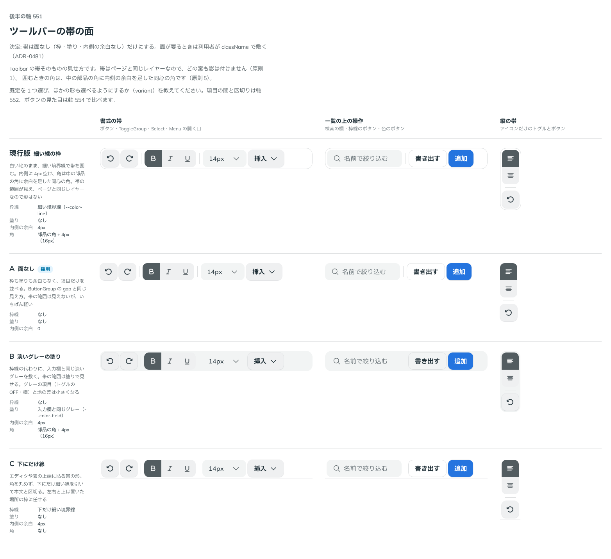

# 0481. Toolbar の帯は面を持たない。面が要るときは使う側が敷く

- ステータス: Accepted
- 日付: 2026-10-07
- ラウンド: 第 1 波 軸 551（Toolbar）
- 決めた時点のコミット: `72399642`（`git checkout 72399642 && pnpm storybook` で、決めたときの部品のまま比較を開けます）

## 背景

Toolbar は、ボタン・トグル・区切り・欄を 1 本の帯に並べ、矢印キーで移る部品です。帯に枠や塗りを持たせるかを比べました。

比較のストーリーは `design/stories/axis-551-toolbar-surface.stories.tsx` でした（決めたあとに消しました）。

## 候補

| 案     | 内容                             |
| ------ | -------------------------------- |
| 現行版 | 細い線の枠（内側 4px・同心の角） |
| A      | 面なし（枠も塗りも余白もない）   |
| B      | 淡いグレーの塗り                 |
| C      | 下にだけ線                       |

## 決定

**A（面なし）だけにします。** variant は作りません。

## 理由

ユーザーの返事の原文です。

> MenuBar(541) と同じく必要なら敷いてもらう前提で、A でいいかなと思いました。

## 却下した案と理由

- 現行版・B・C: Menubar（ADR-0478）と同じく、帯の置き場（エディタの上端・フッター・カードの中）ごとに必要な面が違い、props では拾いきれない
- B: グレーの項目（トグルの OFF・欄）と地の差が小さくなる

## 影響

- `src/components/toolbar/Toolbar.tsx`: 帯は枠・塗り・内側の余白を持ちません
- 帯の面のトークンは畳みました。比較のストーリーは消しました

## 原則への反映

反映なし。原則の文は変えていません。

## 比較画像

