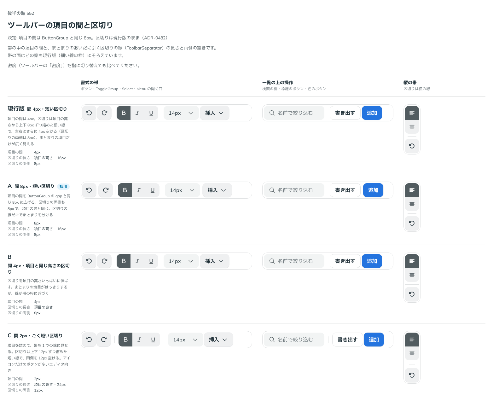

# 0482. Toolbar の項目の間は 8px。ButtonGroup の間と同じにする

- ステータス: Accepted
- 日付: 2026-10-07
- ラウンド: 第 1 波 軸 552（Toolbar）
- 決めた時点のコミット: `72399642`（`git checkout 72399642 && pnpm storybook` で、決めたときの部品のまま比較を開けます）

## 背景

項目の間と、区切りの線の長さ・両側の空きを比べました。

比較のストーリーは `design/stories/axis-552-toolbar-spacing.stories.tsx` でした（決めたあとに消しました）。

## 候補

| 案     | 内容                                              |
| ------ | ------------------------------------------------- |
| 現行版 | 間 4px・区切りは上下 8px 縮めた短い線（両側 8px） |
| A      | 間 8px・短い区切り（両側も 8px で項目の間と同じ） |
| B      | 間 4px・項目と同じ高さの区切り                    |
| C      | 間 2px・ごく短い区切り                            |

## 決定

**A を採ります。** 項目の間は 8px（ButtonGroup の間と同じ）、区切りは項目の高さから上下 8px ずつ縮めた線で、左右の空きは項目の間と同じです。

## 理由

ユーザーの返事の原文です。

> A かなあと思いました。現行版だとちょっと間隔が狭すぎるかなと

## 却下した案と理由

- 現行版: 間が狭すぎる
- B: 線が項目の高さいっぱいで重い
- C: 詰めた塊は、文字のボタンやトグルが混じる帯には向かない

## 影響

- `src/components/toolbar/Toolbar.tsx`: 項目の間を `--button-group-gap` にしました
- `src/components/toolbar/toolbar.tokens.css`: 残すのは区切りの縮め量 `--toolbar-separator-inset` だけです。区切りの両側の空きのトークンは畳みました。比較のストーリーは消しました

## 原則への反映

反映なし。原則の文は変えていません。

## 比較画像

