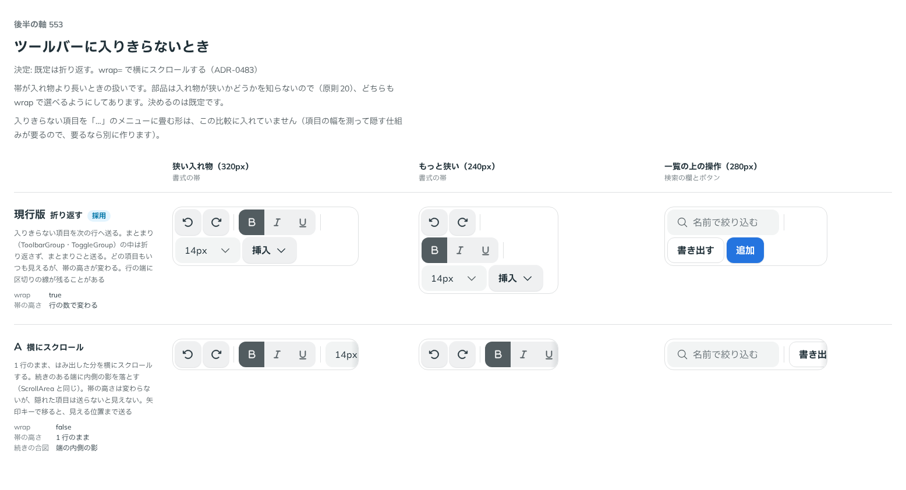

# 0483. Toolbar は入りきらないとき折り返す。wrap={false} で横にスクロールする

- ステータス: Accepted
- 日付: 2026-10-07
- ラウンド: 第 1 波 軸 553（Toolbar）
- 決めた時点のコミット: `72399642`（`git checkout 72399642 && pnpm storybook` で、決めたときの部品のまま比較を開けます）

## 背景

帯の幅に項目が入りきらないときの扱いを比べました。

比較のストーリーは `design/stories/axis-553-toolbar-overflow.stories.tsx` でした（決めたあとに消しました）。

## 候補

| 案     | 内容                                                                        |
| ------ | --------------------------------------------------------------------------- |
| 現行版 | 折り返す。まとまり（ToolbarGroup・ToggleGroup）は、まとまりごと次の行へ送る |
| A      | 1 行のまま横にスクロール。続きのある端に内側の影を落とす                    |

## 決定

**既定は折り返しです。** `wrap={false}` で、1 行のまま横にスクロールできます。

## 理由

ユーザーの返事の原文です。

> ユーザーの選択による（ボタンを小さくして折り返すとか、フッターに一列でおきたいから同じサイズのままスクロールするとか）と思いつつ、デフォルトでは折り返す挙動でいいかなと思いました。スクロールにもできると良さそうですね

## 却下した案と理由

- 折り返しだけ・スクロールだけにする: 場面で必要な形が違う

## 影響

- `src/components/toolbar/Toolbar.tsx`: `wrap`（既定 `true`）。`false` で横スクロールになります
- 入りきらない項目を「…」に畳む形は作っていません（backlog）

## 原則への反映

反映なし。原則の文は変えていません。

## 比較画像

