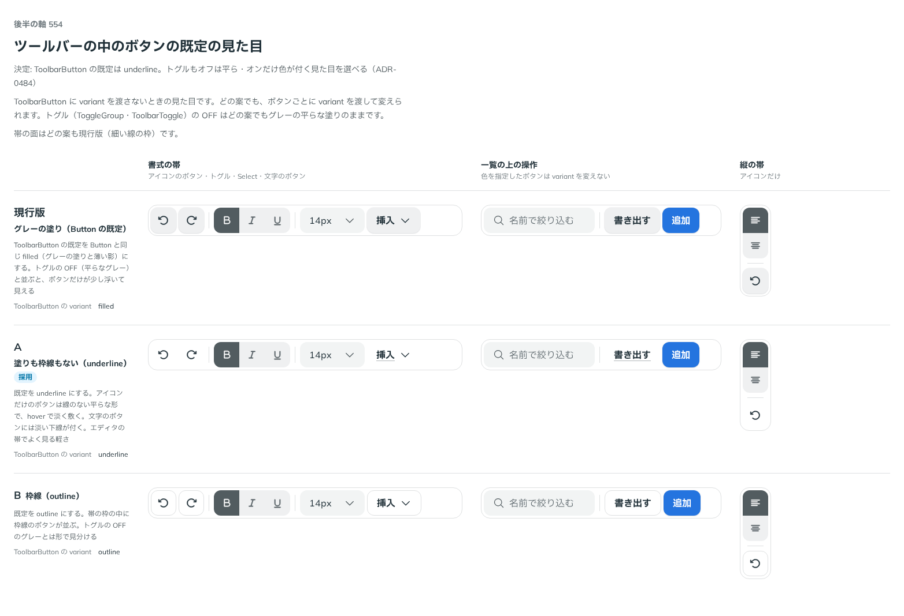

# 0484. ToolbarButton の既定は underline。トグルは filled が既定のまま、underline を選べる

- ステータス: Accepted
- 日付: 2026-10-07
- ラウンド: 第 1 波 軸 554（Toolbar・Toggle）
- 決めた時点のコミット: `72399642`（`git checkout 72399642 && pnpm storybook` で、決めたときの部品のまま比較を開けます）

## 背景

帯の中のボタンの既定の見た目を比べました。Button の既定（filled）のままだと、トグルの OFF（平らなグレー）と並んだとき、ボタンだけが少し浮いて見えます。

比較のストーリーは `design/stories/axis-554-toolbar-button-look.stories.tsx` でした（決めたあとに消しました）。

## 候補

| 案     | 内容                                            |
| ------ | ----------------------------------------------- |
| 現行版 | filled（グレーの塗りと薄い影）                  |
| A      | underline（塗りも枠線もない。hover で淡く敷く） |
| B      | outline（枠線）                                 |

## 決定

**A（underline）を ToolbarButton の既定にします。** トグルの既定は filled のままで、`variant="underline"` にすると、OFF は平ら・ON だけ色が付く形になります（ToolbarToggle・ToggleGroup）。

## 理由

ユーザーの返事の原文です。

> A が既定かなと思ったりしました。トグルボタンについても、有効でないときに underline にして、オンの時だけ色が付く、とかもユースケースとしてありそうです。

続けて、トグルの既定について:

> トグルは filled 既定で

## 却下した案と理由

- filled: 帯の中でボタンだけが浮く
- outline: 帯の枠がなくなったので、枠線のボタンが並ぶと騒がしい

## 影響

- `src/components/toolbar/Toolbar.tsx`: ToolbarButton の `variant` の既定を `underline` にしました。ToolbarToggle のドキュメントに `variant="underline"` の使い方を書きました
- `src/components/toggle/Toggle.tsx`: 既定は変えていません（filled）

## 原則への反映

反映なし。原則の文は変えていません。

## 比較画像

