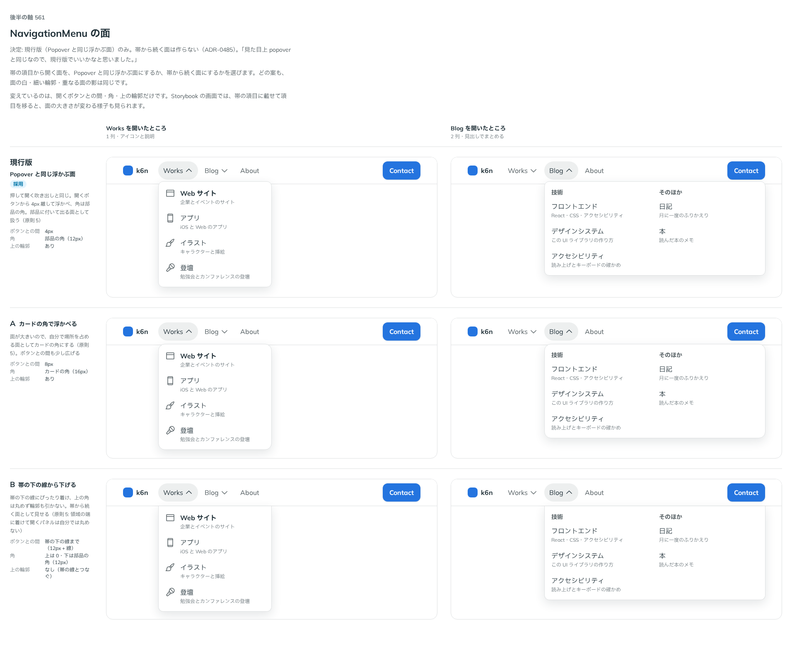

# 0485. NavigationMenu の開く面は Popover と同じ。帯から続く面は作らない

- ステータス: Accepted
- 日付: 2026-10-07
- ラウンド: 第 1 波 軸 561（NavigationMenu）
- 決めた時点のコミット: `e122851d`（`git checkout e122851d && pnpm storybook` で、決めたときの部品のまま比較を開けます）

## 背景

NavigationMenu は、ページの上の帯から行き先の一覧を下に開く部品です。開く面の置き方を比べました。

比較のストーリーは `design/stories/axis-561-navigation-menu-surface.stories.tsx` でした（決めたあとに消しました）。

## 候補

| 案     | 内容                                                    |
| ------ | ------------------------------------------------------- |
| 現行版 | Popover と同じ浮かぶ面（ボタンから 4px 離し、部品の角） |
| A      | カードの角で、ボタンから 8px 離す                       |
| B      | 帯の下の線にぴったり着け、上の角は丸めず輪郭も引かない  |

## 決定

**現行版（Popover と同じ面）にします。** 帯から続く面（B）は作りません。

## 理由

ユーザーの返事の原文です。

> 見た目上 popover と同じなので、現行版でいいかなと思いました。

## 却下した案と理由

- A: 部品に付いて出る面なので、カードの角にはしない（原則 5）
- B: 帯の置き場（下の線の有無・固定の帯）に依存し、部品の中では決められない

## 影響

- `src/components/navigation-menu/navigation-menu.tokens.css`: 面は Popover と同じ（白・細い輪郭・`--shadow-overlay`・部品の角）。`--navigation-menu-offset`・`--navigation-menu-padding`・`--navigation-menu-column-width` を置きました
- 比べるためだけに置いた角・輪郭のトークンは畳みました。比較のストーリーは消しました

## 原則への反映

反映なし。原則の文は変えていません。

## 比較画像

