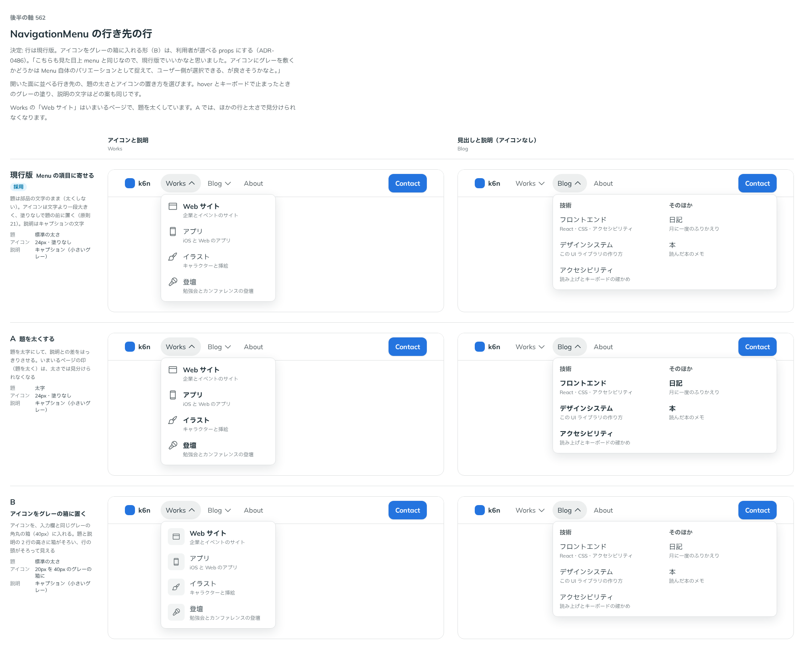

# 0486. 行き先の行は Menu の項目と同じ。アイコンのグレーの箱は iconVariant で選べる（Menu の項目も同じ）

- ステータス: Accepted
- 日付: 2026-10-07
- ラウンド: 第 1 波 軸 562（NavigationMenu・Menu）
- 決めた時点のコミット: `e122851d`（`git checkout e122851d && pnpm storybook` で、決めたときの部品のまま比較を開けます）

## 背景

NavigationMenuLink（題・説明・アイコン）の行の見せ方を比べました。見た目は Menu の項目に近いので、アイコンの扱いだけが争点です。

比較のストーリーは `design/stories/axis-562-navigation-menu-link-row.stories.tsx` でした（決めたあとに消しました）。

## 候補

| 案     | 内容                                                     |
| ------ | -------------------------------------------------------- |
| 現行版 | 題は部品の文字のまま。アイコンは一段大きく、塗りなし     |
| A      | 題を太くする                                             |
| B      | アイコンを、入力欄と同じグレーの角丸の箱（40px）に入れる |

## 決定

**行は現行版です。** アイコンのグレーの箱は、`iconVariant`（`plain` 既定・`soft`）で選べます。Menu の項目（`MenuItem`）にも同じ `iconVariant` を持たせます。

## 理由

ユーザーの返事の原文です。

> こちらも見た目上 menu と同じなので、現行版でいいかなと思いました。アイコンにグレーを敷くかどうかは Menu 自体のバリエーションとして捉えて、ユーザー側が選択できる、が良さそうかなと。

## 却下した案と理由

- A: いまいるページの印（題を太く）と、太さで見分けられなくなる
- 箱を既定にする: Menu と同じ見た目という判断に合わない

## 影響

- `src/internal/menu/item-icon.ts`: `ItemIconVariant`（`plain`・`soft`）と、soft の箱のクラスを置きました。Menu の項目と NavigationMenuLink が共有します
- `src/components/navigation-menu/NavigationMenu.tsx`・`src/components/menu/MenuItem.tsx`: `iconVariant`（既定 `plain`）を足しました
- `src/components/navigation-menu/navigation-menu.tokens.css`: `--navigation-menu-link-icon-size`。箱の塗りは次の ADR-0491 のトークンです

## 原則への反映

反映なし。原則の文は変えていません。

## 比較画像

