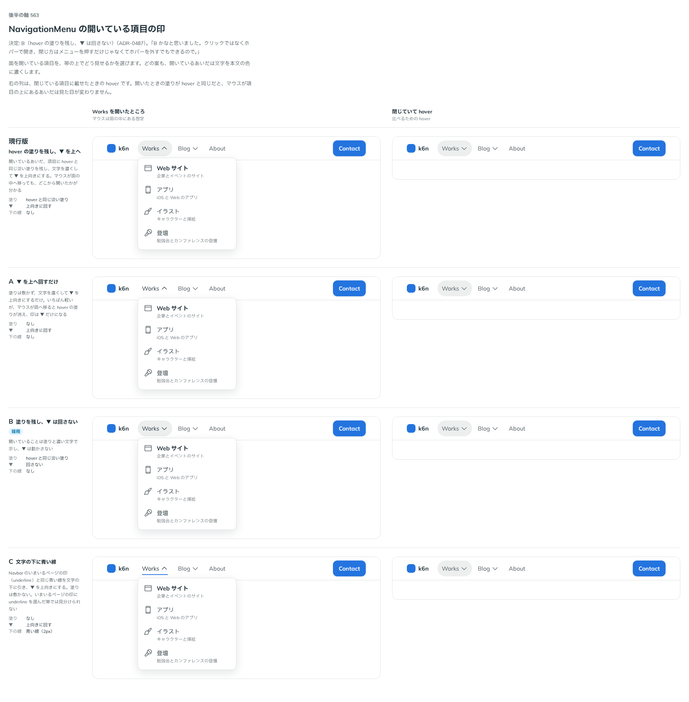

# 0487. NavigationMenu の開いている項目は、塗りを残して ▼ は回さない

- ステータス: Accepted
- 日付: 2026-10-07
- ラウンド: 第 1 波 軸 563（NavigationMenu）
- 決めた時点のコミット: `e122851d`（`git checkout e122851d && pnpm storybook` で、決めたときの部品のまま比較を開けます）

## 背景

行き先を開いているあいだ、その項目にどんな印を残すかを比べました。NavigationMenu は、押さなくても hover で開きます。

比較のストーリーは `design/stories/axis-563-navigation-menu-open-trigger.stories.tsx` でした（決めたあとに消しました）。

## 候補

| 案     | 内容                                 |
| ------ | ------------------------------------ |
| 現行版 | hover の塗りを残し、▼ を上へ回す     |
| A      | ▼ を上へ回すだけ（塗りなし）         |
| B      | 塗りを残し、▼ は回さない             |
| C      | 文字の下に青い線を引き、▼ を上へ回す |

## 決定

**B を採ります。** 開いている項目は、hover と同じ淡い塗りと濃い文字を残し、▼ は動かしません。

## 理由

ユーザーの返事の原文です。

> B かなと思いました。クリックではなくホバーで開き、閉じ方はメニューを押すだけじゃなくてホバーを外すでもできるので。

## 却下した案と理由

- 現行版・A: 押して開く部品ではないので、▼ の向きで開閉を伝えると、hover を外して閉じたときに状態とずれて見える
- C: いまいるページの印（underline）と同じ形で見分けられない

## 影響

- `src/components/navigation-menu/NavigationMenu.tsx`: 開いている項目（`data-popup-open`）に塗りを残し、▼ は回しません
- 比べるためだけに置いた塗り・▼ の回転・線のトークンは畳みました。比較のストーリーは消しました

## 原則への反映

反映なし。原則の文は変えていません。

## 比較画像

