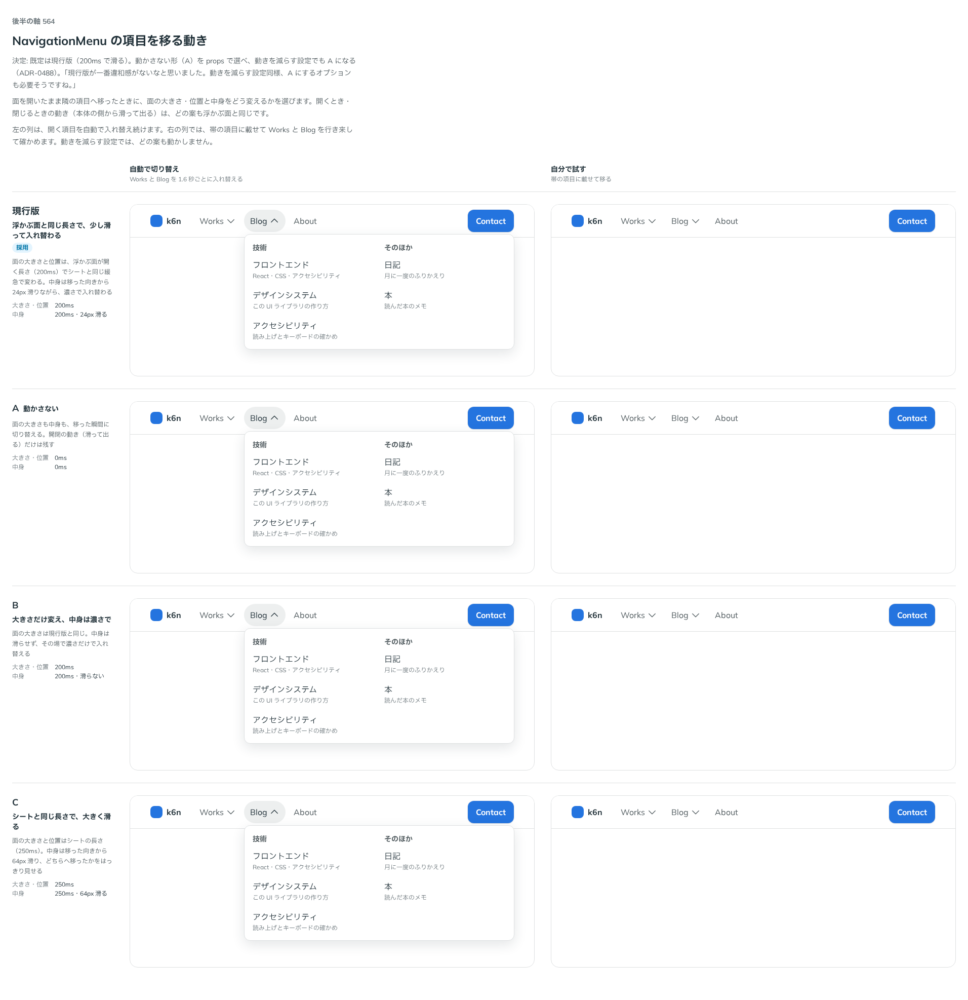

# 0488. NavigationMenu の項目を移る動きは、200ms で滑るのが既定。switchMotion="none" で動かさない

- ステータス: Accepted
- 日付: 2026-10-07
- ラウンド: 第 1 波 軸 564（NavigationMenu）
- 決めた時点のコミット: `e122851d`（`git checkout e122851d && pnpm storybook` で、決めたときの部品のまま比較を開けます）

## 背景

開いたまま隣の項目へ移ったとき、面の大きさ・位置と中身をどう変えるかを比べました。

比較のストーリーは `design/stories/axis-564-navigation-menu-motion.stories.tsx` でした（決めたあとに消しました）。

## 候補

| 案     | 内容                                                                                                  |
| ------ | ----------------------------------------------------------------------------------------------------- |
| 現行版 | 浮かぶ面と同じ長さ（200ms）で大きさと位置を変え、中身は移った向きから 24px 滑りながら濃さで入れ替える |
| A      | 動かさない（すぐ切り替える）                                                                          |
| B      | 大きさだけ変え、中身は濃さだけで入れ替える                                                            |
| C      | シートと同じ長さ（250ms）で、64px 大きく滑る                                                          |

## 決定

**既定は現行版（200ms で滑る）です。** `switchMotion`（`slide` 既定・`none`）で、動かさない A を選べます。動きを減らす設定のときは、`slide` でも A になります。

## 理由

ユーザーの返事の原文です。

> 現行版が一番違和感がないなと思いました。動きを減らす設定同様、A にするオプションも必要そうですね。

## 却下した案と理由

- B: 大きさだけ変わり、移った向きが中身から読めない
- C: 滑りが大きく、項目を次々に移るときに落ち着かない

## 影響

- `src/components/navigation-menu/NavigationMenu.tsx`: `switchMotion`（`slide`・`none`、既定 `slide`）を足しました。`none` と動きを減らす設定では、遷移を切ります
- `src/components/navigation-menu/navigation-menu.tokens.css`: `--navigation-menu-switch-duration`（200ms）・`--navigation-menu-switch-shift`（24px）。`none` では 0 にします。比較のストーリーは消しました

## 原則への反映

原則 14 に、面の中で隣の項目へ移る動きと、動きを減らす設定のときの扱いを足しました（例外ではなく、重なる面の動きの 1 項目として）。

## 比較画像

