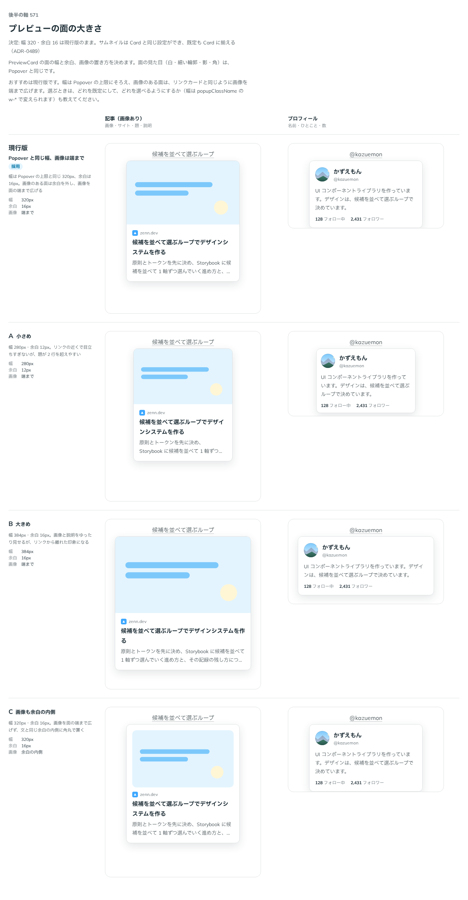

# 0489. PreviewCard の面は幅 320px・余白 16px。画像の置き方は Card と同じ cardVariant で選ぶ

- ステータス: Accepted
- 日付: 2026-10-07
- ラウンド: 第 1 波 軸 571（PreviewCard）
- 決めた時点のコミット: `6a36f3b6`（`git checkout 6a36f3b6 && pnpm storybook` で、決めたときの部品のまま比較を開けます）

## 背景

PreviewCard は、リンクにポインタを載せたときに行き先の中身を見せる面です。面の大きさと、画像の置き方を比べました。

比較のストーリーは `design/stories/axis-571-preview-card-size.stories.tsx` でした（決めたあとに消しました）。

## 候補

| 案     | 内容                                                |
| ------ | --------------------------------------------------- |
| 現行版 | Popover と同じ幅 320px・余白 16px。画像は面の端まで |
| A      | 小さめ（280px・余白 12px）                          |
| B      | 大きめ（384px・余白 16px）                          |
| C      | 画像も余白の内側に角丸で置く                        |

## 決定

**幅 320px・余白 16px にします。** 画像の置き方は Card と同じ設定（`cardVariant`: `default` は端まで、`nested` は内側に角丸で）にし、既定も Card に揃えます。

## 理由

ユーザーの返事の原文です。

> 現行デフォで、サムネイルについてはカードと同じ設定ができて、デフォルトもカードと揃える、でよさそう。

## 却下した案と理由

- A: 題が 2 行を超えやすい
- B: リンクから離れた印象になる

## 影響

- `src/components/preview-card/PreviewCard.tsx`: `cardVariant`（`default`・`nested`、既定 `default`）。`PreviewCardImage` の置き方がこれで決まります
- `src/components/preview-card/preview-card.tokens.css`: `--preview-card-width`（320px）・`--preview-card-padding`（16px）・`--preview-card-offset`。入れ子の余白は Card と同じ `--card-nested-inset`。比較のストーリーは消しました

## 原則への反映

反映なし。原則の文は変えていません。

## 比較画像

