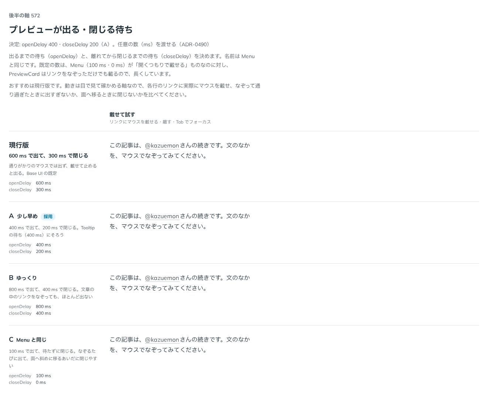

# 0490. PreviewCard は 400ms で出て 200ms で閉じる。待ちは任意の数で渡せる

- ステータス: Accepted
- 日付: 2026-10-07
- ラウンド: 第 1 波 軸 572（PreviewCard）
- 決めた時点のコミット: `6a36f3b6`（`git checkout 6a36f3b6 && pnpm storybook` で、決めたときの部品のまま比較を開けます）

## 背景

ポインタを載せてから面が出るまで、外れてから閉じるまでの待ちを比べました。文章の中のリンクをなぞるだけでは出ず、止めると出るのが狙いです。

比較のストーリーは `design/stories/axis-572-preview-card-delay.stories.tsx` でした（決めたあとに消しました）。

## 候補

| 案     | 内容                                                   |
| ------ | ------------------------------------------------------ |
| 現行版 | 600ms で出て、300ms で閉じる（Base UI の既定）         |
| A      | 400ms で出て、200ms で閉じる（Tooltip の待ちにそろう） |
| B      | 800ms・400ms                                           |
| C      | 100ms・待たずに閉じる                                  |

## 決定

**A を採ります。** `openDelay` は 400、`closeDelay` は 200 が既定で、どちらも任意の数（ms）で渡せます。

## 理由

ユーザーの返事の原文です。

> A でいいかなと。これは任意の数字で設定できますか？

## 却下した案と理由

- 現行版: 出るまでが長い
- B: 文章の中のリンクを狙っても、ほとんど出ない
- C: なぞるたびに出て、面へ斜めに移るあいだに閉じやすい

## 影響

- `src/components/preview-card/PreviewCard.tsx`: `openDelay`（既定 400）・`closeDelay`（既定 200）。数はそのまま Base UI に渡します
- Popover に `openOnHover` は足しません。hover で開く用途は Tooltip か PreviewCard が持ちます（backlog から外しました）。比較のストーリーは消しました

## 原則への反映

反映なし。原則の文は変えていません。

## 比較画像

