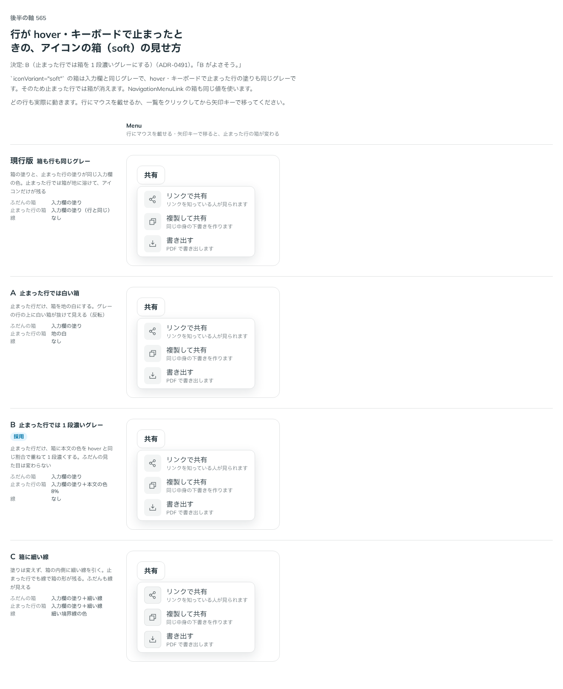

# 0491. 一覧の行のアイコンの箱は、止まった行で 1 段濃いグレーにする

- ステータス: Accepted
- 日付: 2026-10-07
- ラウンド: 第 1 波 軸 565（Menu・NavigationMenu）
- 決めた時点のコミット: `0ec855d5`（`git checkout 0ec855d5 && pnpm storybook` で、決めたときの部品のまま比較を開けます）

## 背景

ADR-0486 の `iconVariant="soft"` の箱は、ふだんは入力欄のグレーです。行が hover・キーボードで止まると、行の塗りも同じ入力欄のグレーなので、箱が地に溶けてアイコンだけが残ります。止まった行の箱の見せ方を比べました。

比較のストーリーは `design/stories/axis-565-item-icon-box-active.stories.tsx` でした（決めたあとに消しました）。

## 候補

| 案     | 内容                                                             |
| ------ | ---------------------------------------------------------------- |
| 現行版 | 箱も行も同じグレー（箱が溶ける）                                 |
| A      | 止まった行だけ白い箱にする（反転）                               |
| B      | 止まった行だけ、本文の色を hover と同じ割合で重ねて 1 段濃くする |
| C      | 箱に細い線を引く（ふだんも見える）                               |

## 決定

**B を採ります。** 箱の塗りは、止まった行だけ 1 段濃いグレーにします。ふだんの見た目は変わりません。Menu の項目と NavigationMenuLink の両方に効きます。

## 理由

ユーザーの返事の原文です。

> 実際に動くサンプルにできますか？固定だと変わったときのイメージが分からず

（止まった行を固定した比較から、実際に hover・矢印キーで動く比較に作り直して見せた）

> B がよさそう。

ふだんの見た目を変えずに、止まった行でも箱の形が残ります。

## 却下した案と理由

- 現行版: 止まった行で箱の形が消える
- A: グレーの行の上に白が抜け、行の中で箱だけが目立つ
- C: ふだんも線が見えて、箱が重くなる

## 影響

- `src/internal/menu/menu.tokens.css`: `--item-icon-box-bg`（入力欄の塗り）・`--item-icon-box-bg-active`（本文の色を hover と同じ割合で重ねたもの）を置きました。箱の線のトークンは畳みました
- `src/internal/menu/item-icon.ts`: 行が止まった状態で `--item-icon-box-current` を `--item-icon-box-bg-active` にします（クラスは Tailwind が拾えるよう、使う側に文字のまま書きます）。比較のストーリーは消しました

## 原則への反映

反映なし。原則の文は変えていません。

## 比較画像

