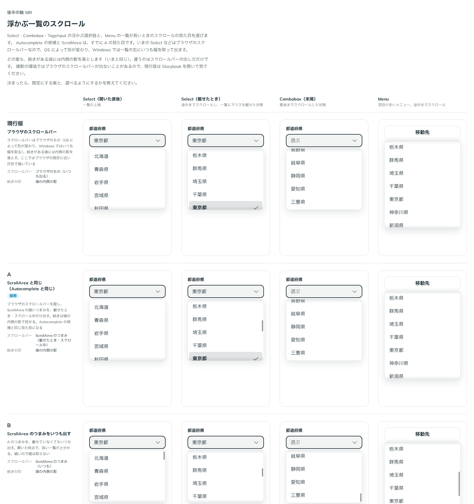

# 0492. 浮かぶ選択肢の一覧は、ScrollArea の見た目にそろえ、つまみをいつも出せる

- ステータス: Accepted
- 日付: 2026-10-08
- ラウンド: 後半 軸 580

## 背景

[ADR-0226](./0226-autocomplete-list-scroll.md) で、Autocomplete の候補の一覧を ScrollArea の見た目（端の内側の影、載せたときとスクロール中に出るつまみ）にそろえました。そのとき、Select・Combobox は「見た目が変わる範囲が広い」として別に決めることにし、backlog に置いていました。

浮かぶ選択肢の一覧（Select・Combobox・TagsInput・Autocomplete・Menu）が、部品ごとに違うスクロールの見た目だと、同じ面なのに違う部品に見えます。この軸で、5 つをそろえます。

ページの本文（Sidebar・Inspector のレイアウトの本文）は、この軸の対象にしませんでした。ユーザーに範囲を尋ね、「対象外にする」と選ばれたためです。ネイティブのスクロールのままで、backlog に残します。

## 候補

比較は、決めた時点のコミット `fea855ff` の比較のストーリー（`design/stories/axis-580-popover-list-scroll.stories.tsx`）です。列は、通常・載せたとき・スクロール中などの一覧の見え方です。

| 案        | スクロールバー                                      | 続きの印     |
| --------- | --------------------------------------------------- | ------------ |
| 現行版    | ブラウザのもの（OS で形が変わる）                   | 端の内側の影 |
| A（採用） | ScrollArea のつまみ（載せたとき・スクロール中だけ） | 端の内側の影 |
| B         | ScrollArea のつまみをいつも出す                     | 端の内側の影 |

## 決定

**A にそろえます。つまみをいつも出したい人は、`popoverScrollbar="always"` を渡せます。`popoverMoreCue` は外します。**

- Select・Combobox・TagsInput・Autocomplete・Menu の一覧は、ブラウザのスクロールバーを隠し、ScrollArea の細いつまみを、載せたとき・スクロール中だけ出します。続きがある端には、内側の影をいつも出します
- `popoverScrollbar`（`'scroll' | 'always'`、既定 `'scroll'`）で、つまみを開いた時点からいつも出せます。5 つの部品が持ちます
- `popoverMoreCue` は、Select・Combobox・TagsInput から外します（破壊的変更）。影を消す指定（`'none'`）はなくなり、影はいつも出ます
- シートの中の一覧は、[ADR-0493](./0493-sheet-content-scroll.md) の決まりに従います

## 理由

ユーザーの返事の原文です。

> 580 A に統一でお願いします（ユーザー側で常時表示の props を渡せる前提）

以下は、決めたときの考えです。

- **そろえる**: 続きがあることを影とつまみで見せる決まり（[原則 1](../principles.md#1-影はレイヤーの離れを表す)）を、浮かぶ一覧のどれでも同じ形にするためです
- **常時表示は選べる**: 長い一覧だと開いた時点で分かりたい場面があります。既定は静かな A にし、B は props で選べるようにします

## 却下した案と理由

- **B を既定にする**: 一覧のたびに細い棒が出て、短い一覧でも賑やかになります。必要な人が `popoverScrollbar="always"` で選べれば足ります
- **現行版のまま、Autocomplete だけそろえる**: ADR-0226 で残した差が、そのまま残ります
- **`popoverMoreCue` を残す**: 影は ScrollArea の見た目に含まれるので、消す選択肢を残す理由がありません

## 影響

- `src/components/select/Select.tsx`・`src/components/combobox/Combobox.tsx`・`src/components/tags-input/TagsInput.tsx`: `popoverMoreCue` を外し、`popoverScrollbar` を足しました
- `src/components/autocomplete/Autocomplete.tsx`・`src/components/menu/Menu.tsx`: `popoverScrollbar` を足しました
- `src/internal/listbox/ListboxScroll.tsx`・`src/internal/ScrollFrame.tsx`: 一覧のスクロールを ScrollFrame で描きます
- 比べるためだけの切り替えのトークンは畳んで消しました
- 比較のストーリーは消しました。backlog から、Select・Combobox の一覧の行を消しました

## 原則への反映

原則 1 の、スクロールできる面の見た目の文を書き換えました。浮かぶ一覧も、ScrollArea と同じ見た目（端の影と、載せたときやスクロール中に出るつまみ）にそろえます。

決めた時点のコミットは `fea855ff` です（`git checkout fea855ff && pnpm storybook` で、切り替えのトークンが効いた比較を開けます）。

## 比較画像

