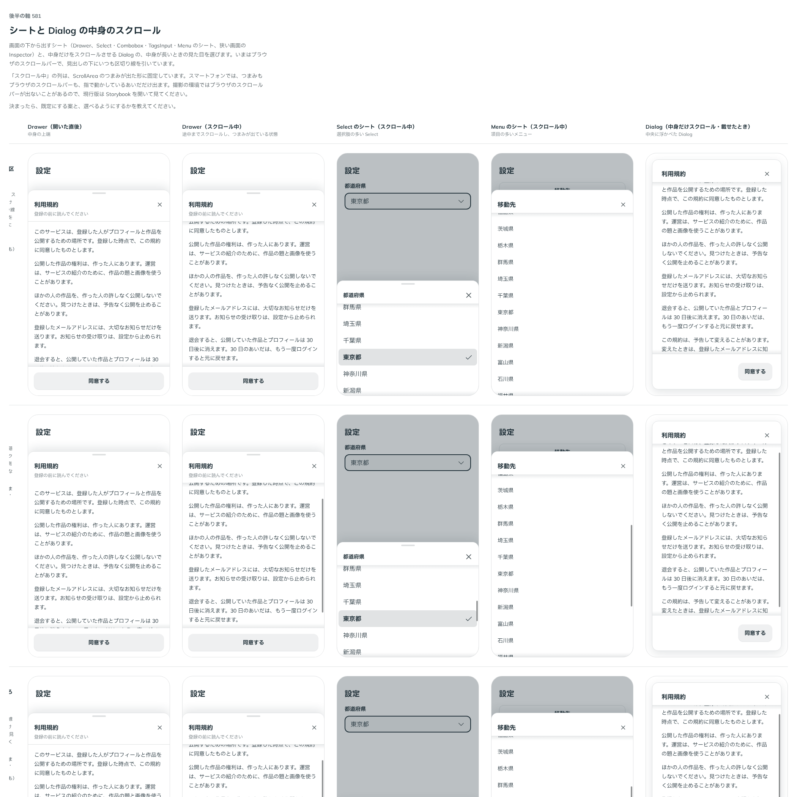

# 0493. シートと Dialog の中身は、区切り線と影を残し、スクロールバーだけ ScrollArea のつまみにする

- ステータス: Accepted
- 日付: 2026-10-08
- ラウンド: 後半 軸 581

## 背景

シート（Drawer・Inspector・選択肢やメニューのシート）と Dialog の中身は、長いとスクロールします。見出しの下の区切り線と、続きがある端の内側の影で続きを見せていますが、スクロールバーはブラウザのものでした。Windows ではいつも幅を取り、スマートフォンではスクロール中だけ出るなど、環境で見た目が変わります。

ページの本文（Sidebar・Inspector のレイアウトの本文）は、この軸の対象にしませんでした。ユーザーに範囲を尋ね、「対象外にする」と選ばれたためです。ネイティブのスクロールのままで、backlog に残します。

## 候補

比較は、決めた時点のコミット `fea855ff` の比較のストーリー（`design/stories/axis-581-sheet-content-scroll.stories.tsx`）です。

| 案        | スクロールバー      | 見出しの下の区切り線 | 続きの印     |
| --------- | ------------------- | -------------------- | ------------ |
| 現行版    | ブラウザのもの      | いつも引く           | 端の内側の影 |
| A         | ScrollArea のつまみ | 引かない             | 端の内側の影 |
| B（採用） | ScrollArea のつまみ | いつも引く           | 端の内側の影 |

## 決定

**B にします。続きの印（区切り線と影）は今のままにして、スクロールバーだけを ScrollArea のつまみ（載せたときとスクロール中だけ出る）に替えます。** 対象は、Drawer・Inspector・選択肢やメニューのシート・Dialog の中身です。

- Tab の止まり方は、今のブラウザ（Chrome）のスクロールする箱と同じです。中身があふれていて、中にフォーカスできるものがないときだけ、中身の枠に Tab で止まり、矢印キーでスクロールできます。中にフォーカスできるものがあれば、枠には止まりません
- 開いた直後のフォーカスの行き先は変えません

## 理由

ユーザーの返事の原文です。

> 581 B かなと思いました。Tab で止まれる挙動は維持したいですね。

以下は、決めたときの考えです。

- **区切り線は、見出しと中身の境として働く**: 影は端の続きを見せますが、見出しと中身の境目は、いつも線で分かるほうが、シートの形（見出し・中身・操作の 3 段）がはっきりします
- **つまみだけを替える**: スクロールバーの見た目が環境で変わる問題は、つまみの置き換えで消えます
- **Tab で止まれる**: キーボードだけの人が、あふれた中身を矢印キーで読めるようにするためです。中にフォーカスできるものがあれば、そちらに止まるので、止まり先を増やしません

## 却下した案と理由

- **A（区切り線を引かない）**: 見出しと中身の境が、影が出ていないときに消えます
- **枠にいつも Tab で止まる**: 中にボタンや欄があるシートで、止まり先が 1 つ増えます。今のブラウザの動きとも違います

## 影響

- `src/internal/ScrollFrame.tsx`: `focusable="auto"` を足しました。あふれていて、中に止まり先がないときだけ Tab で止まります
- `src/internal/use-keyboard-scroller.ts`: 上の判定を持つフックです
- `src/components/dialog/Dialog.tsx`・`src/components/inspector/Inspector.tsx`・`src/internal/sheet/SheetPopup.tsx`（Drawer）: 中身を `src/internal/sheet/MoreCueScroll.tsx`（ScrollFrame）の `focusable="auto"` で描きます。選択肢やメニューのシートの一覧は、項目へ矢印キーで移るので止まり先にしません
- 比べるためだけの切り替えのトークンは畳んで消しました
- 比較のストーリーは消しました。backlog から、シートのスクロールバーの行を消しました

## 原則への反映

原則 1 の、スクロールできる面の見た目の文に、シートと Dialog の中身も含めました。見出しの下の区切り線は残します。原則 15 に、あふれた中身へ Tab で止まる条件を足しました。

決めた時点のコミットは `fea855ff` です。

## 比較画像

