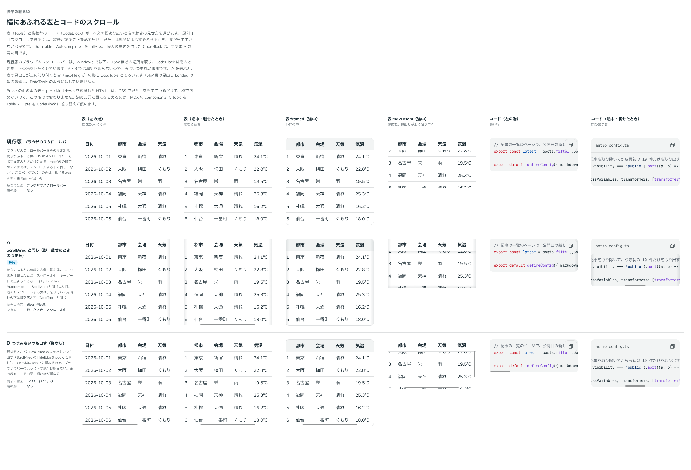

# 0494. Table は外観ごと横に動き、続きは端の影とつまみで見せ、マウスで引っぱって動かせる

- ステータス: Accepted
- 日付: 2026-10-08
- ラウンド: 後半 軸 582

## 背景

Table は、横にあふれると自分の中で横に送りますが、送れることが見た目で分かりませんでした。OS がスクロールバーを出す設定でないと、続きがあることに気づけません。DataTable は端の影の出る枠（ScrollFrame）を持ちますが、Table は持っていませんでした（backlog の「Table の続きの見せ方」）。

## 候補

比較は、決めた時点のコミット `fea855ff` の比較のストーリー（`design/stories/axis-582-reading-scroll.stories.tsx`）です。表と CodeBlock を同じ列で並べています。

| 案     | 続きの合図                                              | 影   |
| ------ | ------------------------------------------------------- | ---- |
| 現行版 | ブラウザのスクロールバー                                | なし |
| A      | 端の内側の影と、載せたときのつまみ（ScrollArea と同じ） | あり |
| B      | つまみをいつも出す                                      | なし |

## 決定

**A の見せ方にします。ただし、表の中身だけを動かすのではなく、外観ごと横に動かします。マウスでは、引っぱって動かせます。**

- 横にあふれると、外枠・角・見出しの面ごと横に動きます。続きのある端に内側の影を落とし、つまみは載せたときとスクロール中に出ます
- `maxHeight` を渡したときは、縦も同じ包みで、外観ごとスクロールします。貼り付いた見出しの下に影を落とします
- マウスでは、スマートフォンのように、引っぱって表を動かせます。ボタン・リンクなどの操作できるものの上と、文字の上では引っぱりません（押す操作と文字の選択はそのままです）
- `dragToScroll={false}` で、引っぱる動きを切れます（`@default true`）
- Tab の止まり方は今と同じです（あふれていて、中にフォーカスできるものがないときだけ、表に止まります）

## 理由

ユーザーの返事の原文です。

> 582 A にしたいところですが、表の中身がスクロールされるのではなく、外観ごと動くようにしたいです。また、マウス操作の場合、スマホのようにドラックアンドドロップで表を動かせるようにしたいですが、文字選択やボタン操作については支障ないようにしたいです。

> 念のため、マウスで引っ張れるようにする挙動は、オフにもできるようにお願いします。

> Tab での挙動はできる限り現在の状態を維持したいですね。

以下は、決めたときの考えです。

- **外観ごと動かす**: 表の外枠や角が止まったまま中身だけが動くと、枠から文字が切れて見えます。外観ごと動けば、表が 1 枚の物として動いて見えます
- **引っぱるのは文字のない場所から**: 文字の上の引っぱりは選択のために空けておき、ボタンやリンクは押せるままにします

## 却下した案と理由

- **中身だけを動かす（枠は止める）**: 上のとおり、枠から切れて見えます
- **B（つまみをいつも出す）**: 表の線に細い棒が重なります。続きの印としても、端の影のほうが先に目に入ります
- **縦も内側に入れ子の枠を作る**: 縦のつまみが画面の外に行きます。Tab の止まり先も増えます。同じ包みで縦横とも動かします
- **引っぱる動きをいつも有効にする**: 使い方によっては邪魔になるので、切れるようにしました

## 影響

- `src/components/table/Table.tsx`: 外観ごとスクロールする包みを ScrollFrame にしました。`dragToScroll`（`@default true`）を足しました
- `src/components/table/use-drag-scroll.ts`: マウスで引っぱる動きです
- `src/components/table/table.tokens.css`: 比べるためだけの切り替えのトークンを畳んで消しました
- `src/components/table/Table.stories.tsx`: 外観ごと動くこと・引っぱる動き・切れることを play で確かめます
- 比較のストーリーは消しました。backlog から、Table の続きの見せ方の決まった部分を消しました（最初の列の固定は残します）

## 原則への反映

原則 1 に、表は外観ごと動き、マウスでも引っぱれることを足しました。

決めた時点のコミットは `fea855ff` です。

## 比較画像

比較画像には、表と CodeBlock（[ADR-0495](./0495-code-block-scroll.md)）の両方が写っています。

