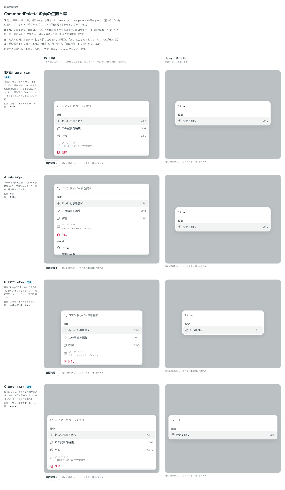

# 0496. CommandPalette の面は画面の上寄りに置き、幅は 560px を既定に 480px・640px の段を選べる

- ステータス: Accepted
- 日付: 2026-10-08
- ラウンド: 後半 軸 590

## 背景

CommandPalette は、⌘K などで開いて打って探し、その場で実行する面です。面を画面のどこに置き、どの幅にするかを決める必要がありました。打つと候補が減って面の高さが変わるので、検索欄の位置が動くかどうかが、位置の選び方で変わります。

## 候補

| 案             | 位置                       | 幅                           |
| -------------- | -------------------------- | ---------------------------- |
| 現行版（採用） | 上寄せ（画面の高さの 12%） | 560px                        |
| A              | 中央                       | 560px                        |
| B              | 上寄せ                     | 480px（Dialog の既定と同じ） |
| C              | 上寄せ                     | 640px                        |

## 決定

**上寄せだけにします。** 中央に置く形は作りません。幅は 560px を既定にし、`size` で 480px（`sm`、B に当たる段）と 640px（`lg`、C に当たる段）も選べます。

- 面の上の位置は、画面の高さの 12% です。狭い画面では Dialog と同じ余白まで詰めます
- 幅の段の名前は Dialog の `size` の語彙に寄せました（`sm`・`md`・`lg`）。`sm` は Dialog の既定と同じ幅です
- 指で操作していて画面が狭いときのシートは、幅いっぱいです

## 理由

ユーザーの返事の原文です。

> 中央は無し、デフォルトは現行サイズで、サイズを変更できるならよさそうです。

以下は、決めたときの考えです。

- **上寄せなら、検索欄が動かない**: 中央に置くと、打って候補が減るたびに面が縮み、検索欄が上下に動きます。打っている手元の位置が変わらないほうが、打ち続けやすいためです
- **幅は一段広い 560px**: 候補の右端のショートカットと 2 行目が並んでも、窮屈になりません。480px では長い文字とショートカットが詰まり、640px では左の文字と右のショートカットが離れすぎます。どちらも使う場面があるので、段で選べるようにしました

## 却下した案と理由

- **A（中央）**: 候補が減ると検索欄が上下に動くため、採りません

## 影響

- `src/components/command-palette/command-palette.tokens.css`: 幅の `--command-palette-width-sm`・`--command-palette-width`・`--command-palette-width-lg` と、上との間の `--command-palette-offset` を持ちます。比べるためだけに足した位置の切り替え（`--command-palette-align`）は畳んで消しました
- `src/components/command-palette/CommandPalette.tsx`: `size`（`'sm' | 'md' | 'lg'`、既定は `'md'`）を足しました
- backlog に、検索欄の位置の生の値（12dvh）とシートの高さ（85% 固定）を足しました

## 原則への反映

反映なし。面の位置と幅の選び方は、既存の原則の範囲内です。

決めた時点のコミットは `7087a764` です。PR #164 を squash でマージしたので、このコミットは main にはありません。`git fetch origin pull/164/head` のあとで `git checkout 7087a764 && pnpm storybook` を流すと、決めたときの部品のまま比較を開けます。

## 比較画像

