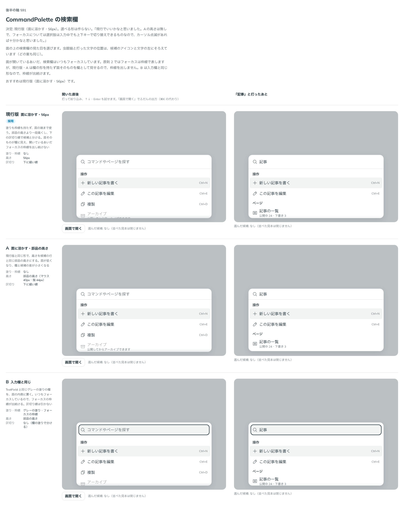

# 0497. CommandPalette の検索欄は、枠も塗りも持たず面に溶かし、下の線で候補と分ける

- ステータス: Accepted
- 日付: 2026-10-08
- ラウンド: 後半 軸 591

## 背景

CommandPalette は、開いているあいだ検索欄にいつもフォーカスがあります。原則 2 ではフォーカスを枠線で表しますが、いつも当たっている欄に枠線を出し続けるのが良いかは、別の問いです。検索欄を入力欄の形にするか、面に溶かすかを決める必要がありました。

## 候補

| 案             | 塗り・枠線                     | 高さ                               | 区切り     |
| -------------- | ------------------------------ | ---------------------------------- | ---------- |
| 現行版（採用） | なし                           | 56px                               | 下に細い線 |
| A              | なし                           | 部品の高さ（マウス 40px・指 44px） | 下に細い線 |
| B              | グレーの塗り・フォーカスの枠線 | 部品の高さ                         | なし       |

## 決定

**現行版にします。** 塗りも枠線も持たず、面の端まで使い、下の細い線で候補と分けます。高さは部品の高さより一段高い 56px です。選べる形は作りません。

- 虫眼鏡と打った文字の位置は、候補のアイコンと文字の左にそろえます

## 理由

ユーザーの返事の原文です。

> 現行でいいかなと思いました。Aの高さは無しで、フォーカスについては選択肢は入力中でも上下キーで切り替えできるものなので、カーソル点滅があれば十分かなと思いました。（入力中に切替できないならフォーカスがあるのが望ましいイメージ）

以下は、決めたときの考えです。

- **面そのものが欄に見える**: 面を開けば打つ場所だと分かるので、欄の形を重ねて持たせる必要がありません
- **フォーカスの線はなくてよい**: 開いているあいだ、フォーカスは検索欄にあり続けます。入力中も上下キーで候補を移れるので、フォーカスが検索欄から離れる場面がなく、カーソルの点滅で足ります。入力中に候補へ移れない作りなら、フォーカスの線が要ります
- **高さは一段高く**: 面の入口として目に入ります。部品の高さでは、欄と候補の行の差が小さくなります

## 却下した案と理由

- **A（部品の高さ）**: 欄と候補の差が小さくなり、面の入口が目に入りにくいため、採りません
- **B（入力欄と同じ）**: フォーカスの枠線が出続けて、面が重く見えます

## 影響

- `src/components/command-palette/command-palette.tokens.css`: 検索欄の高さ `--command-palette-input-height`（56px）を持ちます。比べるためだけに足した塗り・枠線・区切りの切り替えは畳んで消しました

## 原則への反映

反映なし。原則 2 はフォーカスを枠線で表しますが、この検索欄は欄の形を持たず、面そのものを欄として見せるので、枠線を出しません。

決めた時点のコミットは `7087a764` です。PR #164 を squash でマージしたので、このコミットは main にはありません。`git fetch origin pull/164/head` のあとで `git checkout 7087a764 && pnpm storybook` を流すと、決めたときの部品のまま比較を開けます。

## 比較画像

