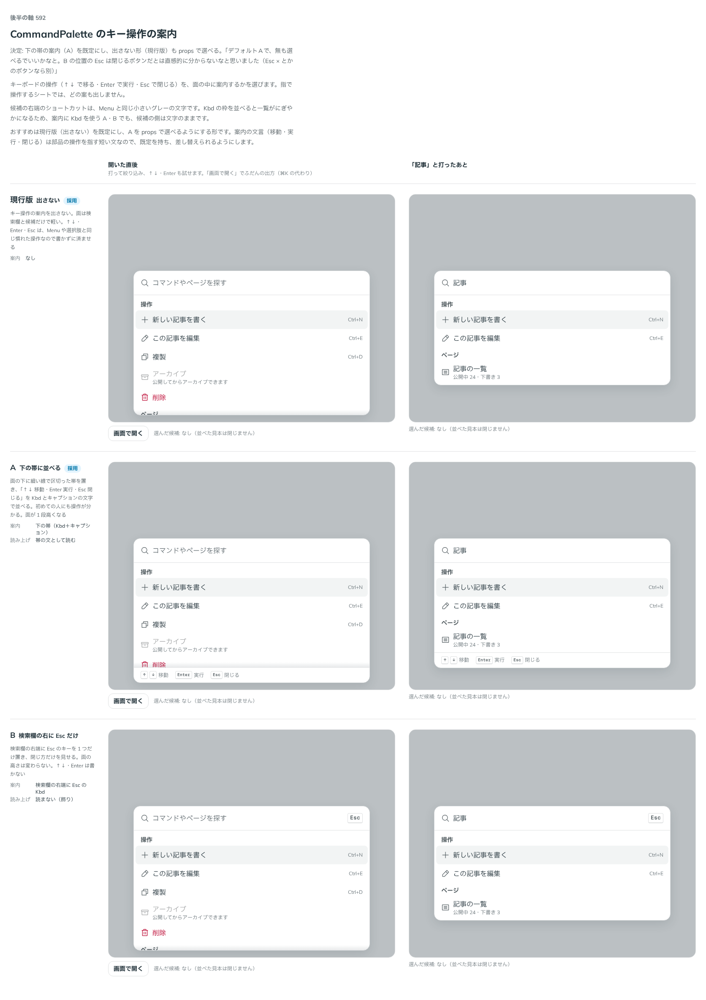

# 0498. CommandPalette のキー操作の案内は、下の帯に並べるのが既定。出さない形も選べる

- ステータス: Accepted
- 日付: 2026-10-08
- ラウンド: 後半 軸 592

## 背景

CommandPalette は、キーボードで使う面です。↑↓ で移る・Enter で実行・Esc で閉じる、という操作を面の中で案内するかを決める必要がありました。初めての人には案内があると分かりやすい一方、慣れた人には要らず、面が 1 段高くなります。

## 候補

| 案        | 案内                                       | 読み上げ         |
| --------- | ------------------------------------------ | ---------------- |
| 現行版    | 出さない                                   | -                |
| A（採用） | 下の帯（Kbd とキャプションの文字）に並べる | 帯の文として読む |
| B         | 検索欄の右端に Esc の Kbd だけ             | 読まない（飾り） |

## 決定

**A にします。** 面の下に細い線で区切った帯を置き、「↑↓ 移動・Enter 実行・Esc 閉じる」を Kbd とキャプションの文字で並べます。`hideKeyHints` で出さない形（現行版）も選べます。

- 指で操作するシートでは、いつも出しません
- 帯の文言は `moveHintLabel`・`runHintLabel`・`closeHintLabel` で差し替えられます（既定は「移動」「実行」「閉じる」）
- 候補の右端のショートカットは、Menu と同じ小さいグレーの文字のままです。案内の Kbd とは別です
- 帯の案内は検索欄の説明には結びません

## 理由

ユーザーの返事の原文です。

> デフォルトAで、無も選べるでいいかなと。B の位置の Esc は閉じるボタンだとは直感的に分からないなと思いました（Esc × とかのボタンなら別）

以下は、決めたときの考えです。

- **初めての人にも操作が分かる**: ↑↓・Enter・Esc は、慣れた人には当たり前の操作ですが、初めて開いた人には書いてあるほうが親切です
- **出さない形も残す**: 慣れた人だけが使う画面や、面を軽くしたい場面では、帯を隠せるようにします
- **B は閉じる操作に見えない**: 検索欄の右にある Esc は飾りに見え、押して閉じるものだと伝わりません

## 却下した案と理由

- **B（検索欄の右に Esc だけ）**: 閉じるボタンだと直感的に分かりません。「Esc ×」のようなボタンにする形なら別の案になります

## 影響

- `src/components/command-palette/CommandPalette.tsx`: `hideKeyHints`（既定は `false`）と、`moveHintLabel`・`runHintLabel`・`closeHintLabel` を足しました
- 比べるためだけに足した、案内の出し分けのトークンは畳んで消しました
- backlog に、下の帯の案内の読み上げ（検索欄の説明に結ばない今の形でよいか）を足しました

## 原則への反映

反映なし。案内の文言の props 名は、props.md の語彙にないため backlog に確認中として残しました。

決めた時点のコミットは `7087a764` です。PR #164 を squash でマージしたので、このコミットは main にはありません。`git fetch origin pull/164/head` のあとで `git checkout 7087a764 && pnpm storybook` を流すと、決めたときの部品のまま比較を開けます。

## 比較画像

