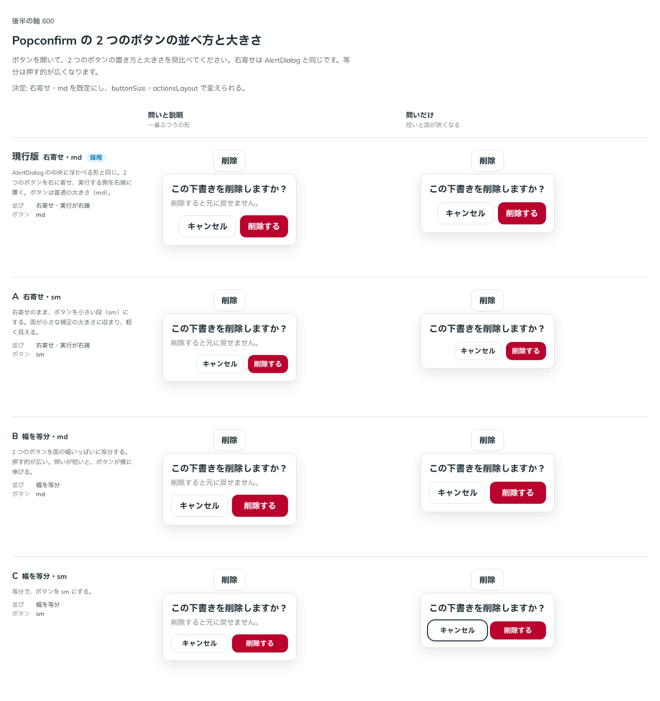

# 0499. Popconfirm の 2 つのボタンは、右寄せ・md が既定。buttonSize と actionsLayout で変えられる

- ステータス: Accepted
- 日付: 2026-10-08
- ラウンド: 後半 軸 600

## 背景

Popconfirm は、ボタンの近くに浮かべる小さな確かめです。2 つのボタン（取り消す側と実行する側）の並べ方と大きさで、面の軽さと押しやすさが変わります。

## 候補

| 案             | 並び               | ボタン |
| -------------- | ------------------ | ------ |
| 現行版（採用） | 右寄せ・実行が右端 | md     |
| A              | 右寄せ・実行が右端 | sm     |
| B              | 幅を等分           | md     |
| C              | 幅を等分           | sm     |

## 決定

**右寄せ・md を既定にします。** `actionsLayout`（`'end'`・`'fill'`）と `buttonSize`（`'sm'`・`'md'`）で変えられます。

- 右寄せは、実行する側を右端に置きます。AlertDialog の中央に浮かべる形と同じです
- `fill` は、2 つのボタンを面の幅いっぱいに等分します

## 理由

ユーザーの返事の原文です。

> おすすめ通り、現行既定で変更可能がよいかなと

以下は、決めたときの考えです。

- **AlertDialog とそろえる**: 確かめの面の並びが部品によって違うと、実行する側がどちらにあるか迷います
- **押す的の広さは場面しだい**: 等分は押す的が広く、小さい段は面が軽くなります。どちらも使う場面があるので、props で選べるようにしました

## 却下した案と理由

- 既定にしない案はありません。A・B・C はいずれも props で選べます

## 影響

- `src/components/popconfirm/Popconfirm.tsx`: `actionsLayout`（既定 `'end'`）と `buttonSize`（既定 `'md'`）を足しました
- backlog に、シートで出すときのボタンの並べ方を足しました

## 原則への反映

反映なし。

決めた時点のコミットは `40b93e6d` です。PR #164 を squash でマージしたので、このコミットは main にはありません。`git fetch origin pull/164/head` のあとで `git checkout 40b93e6d && pnpm storybook` を流すと、決めたときの部品のまま比較を開けます。

## 比較画像

