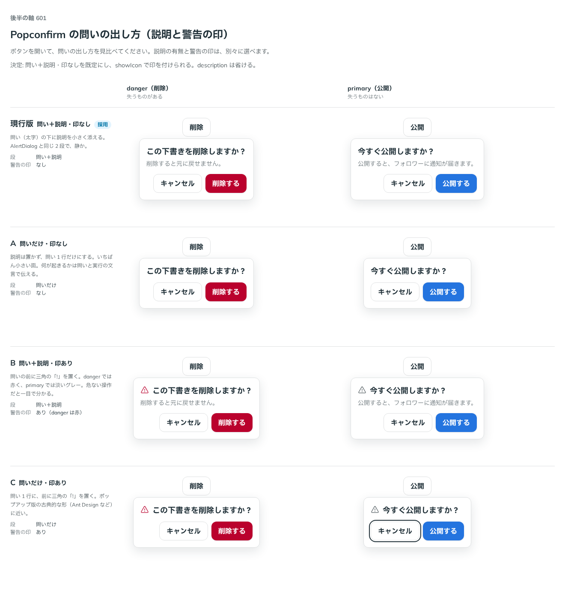

# 0500. Popconfirm の問いは、問いと説明の 2 段で印なしが既定。showIcon で印を付け、description は省ける

- ステータス: Accepted
- 日付: 2026-10-08
- ラウンド: 後半 軸 601

## 背景

Popconfirm の面の上に、何を出すかを決める必要がありました。問いの下に説明を置くか、問いの前に警告の印（三角の「!」）を置くかです。印は、失うものがある操作を一目で伝えますが、面を重くします。

## 候補

| 案             | 段         | 警告の印            |
| -------------- | ---------- | ------------------- |
| 現行版（採用） | 問い＋説明 | なし                |
| A              | 問いだけ   | なし                |
| B              | 問い＋説明 | あり（danger は赤） |
| C              | 問いだけ   | あり                |

## 決定

**問い＋説明・印なしを既定にします。** `showIcon` で印を付けられ、`description` は省けます。

- 印は、danger では赤く、primary では淡いグレーです
- 説明は、起きることや元に戻せないことを書きます。一言で足りる問いは、題だけにします

## 理由

ユーザーの返事の原文です。

> おすすめ通り、現行既定で印をつけられる、説明もなしにできる、がよさそう

以下は、決めたときの考えです。

- **AlertDialog と同じ 2 段で静か**: 問い（太字）の下に説明を小さく添える形は、AlertDialog と同じです
- **印と説明は別々に選べる**: 失うものの大きさは操作によって違います。印を付けるかと説明を置くかは、使う側が決められるようにします

## 却下した案と理由

- 既定にしない案はありません。A・B・C はいずれも props の組み合わせで作れます

## 影響

- `src/components/popconfirm/Popconfirm.tsx`: `showIcon`（既定 `false`）を足しました。`description` は省けます
- backlog に、onAction が失敗したあとの知らせ方と、入力で確かめる形は AlertDialog を使うことを足しました

## 原則への反映

反映なし。

決めた時点のコミットは `40b93e6d` です。

## 比較画像

