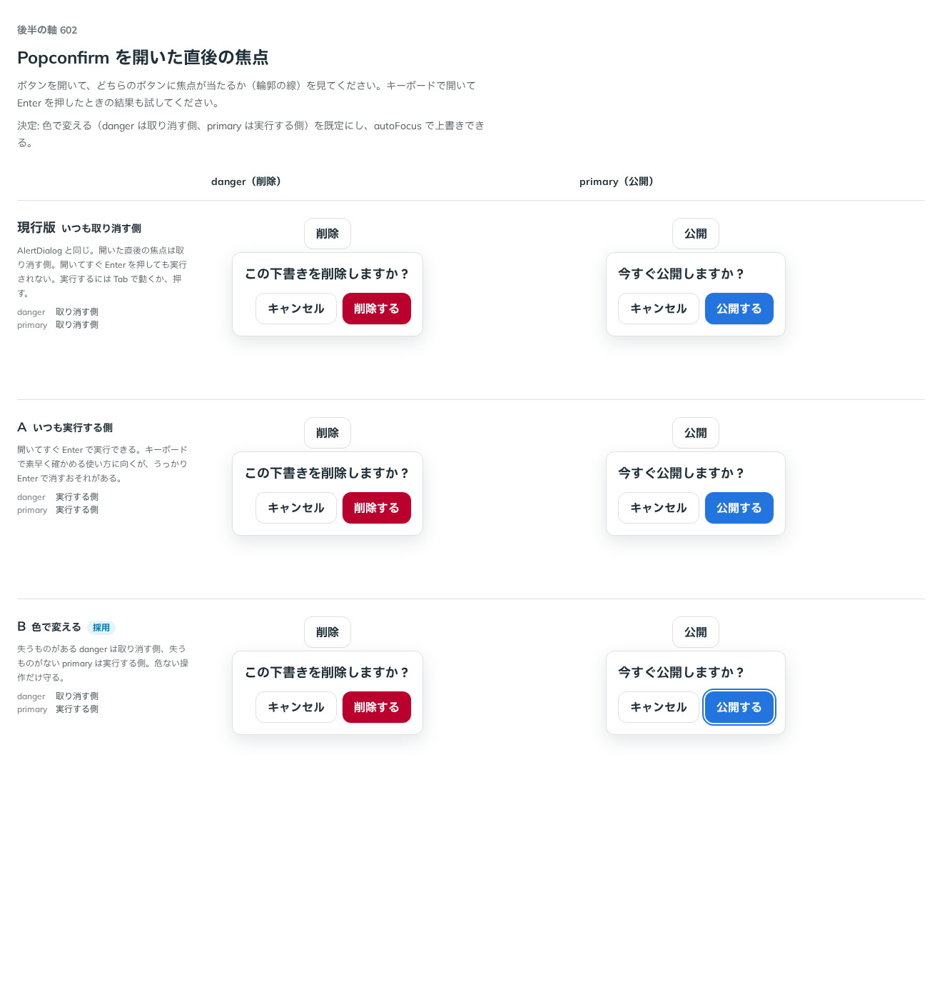

# 0501. Popconfirm を開いた直後の焦点は、色で変える。失うものがあれば取り消す側、なければ実行する側

- ステータス: Accepted
- 日付: 2026-10-08
- ラウンド: 後半 軸 602

## 背景

Popconfirm を開いた直後、どちらのボタンに焦点を当てるかで、開いてすぐ Enter を押したときの結果が変わります。AlertDialog は、いつも取り消す側です。

## 候補

| 案        | danger（削除） | primary（公開） |
| --------- | -------------- | --------------- |
| 現行版    | 取り消す側     | 取り消す側      |
| A         | 実行する側     | 実行する側      |
| B（採用） | 取り消す側     | 実行する側      |

## 決定

**B にします。** 失うものがある `danger` は取り消す側、失うものがない `primary` は実行する側に焦点を当てます。`autoFocus` で上書きできます（`'cancel'`・`'action'`、または要素）。

## 理由

ユーザーの返事の原文です。

> 安全に倒して、B かなあと思っています。ユーザーに変更できる余地を残しておけば良さそう

以下は、決めたときの考えです。

- **危ない操作だけ守る**: 消すなど失うものがある操作は、うっかり Enter で実行しないよう、取り消す側に置きます
- **失うものがない確かめは速く**: 公開や送信のように、失うものがない確かめは、開いてすぐ Enter で実行できるほうが速く進みます
- **上書きできる**: 場面によっては違う側がよいので、`autoFocus` で変えられるようにします

## 却下した案と理由

- **現行版（いつも取り消す側）**: 失うものがない確かめでも、毎回 Tab で動く手間が増えます
- **A（いつも実行する側）**: 消す操作で、うっかり Enter で実行するおそれがあります

## 影響

- `src/components/popconfirm/Popconfirm.tsx`: `autoFocus` の既定を `color` で決めます
- 原則 15 の、取り消せない操作を確かめる面の焦点の文を書き換えました

## 原則への反映

原則 15 の「取り消せない操作を確かめる面では取り消しの側に置きます」を、失うものがある確かめは取り消しの側、失うものがない確かめは実行する側に書き換えました。

決めた時点のコミットは `40b93e6d` です。

## 比較画像

