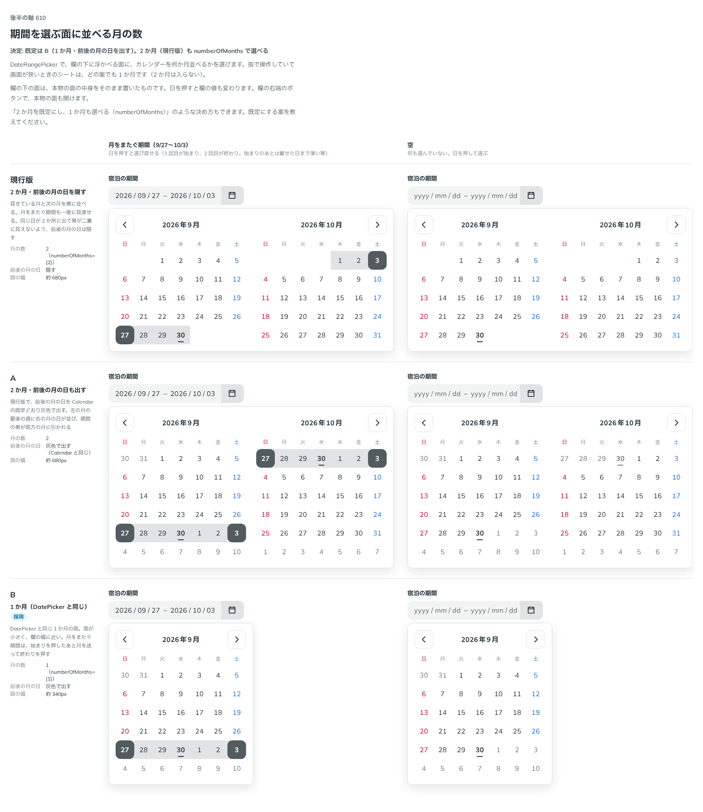

# 0502. DateRangePicker の面は 1 か月が既定で、前後の月の日も出す。2 か月は numberOfMonths で選べる

- ステータス: Accepted
- 日付: 2026-10-08
- ラウンド: 後半 軸 610

## 背景

DateRangePicker は、期間（始まりと終わりの日）を選ぶ入力欄です。ADR-0133 から、カレンダーを 2 か月並べて見せるかを決めずに残していました。月をまたぐ期間を選ぶとき、2 か月が見えると一度に見渡せますが、面が広くなります。

## 候補

| 案        | 月の数 | 前後の月の日 | 面の幅   |
| --------- | ------ | ------------ | -------- |
| 現行版    | 2      | 隠す         | 約 680px |
| A         | 2      | 灰色で出す   | 約 680px |
| B（採用） | 1      | 灰色で出す   | 約 340px |

## 決定

**B にします。** 既定は 1 か月で、前後の月の日も（Calendar と同じく灰色で）出します。2 か月（現行版・A）は `numberOfMonths={2}` で選べます。

- 2 か月を並べるときは、同じ日が 2 か所に出て帯が二重に見えないよう、前後の月の日を既定で隠します
- 指で操作していて画面が狭いときのシートは、1 か月です（2 か月は入りません）

## 理由

ユーザーの返事の原文です。

> デフォルトは1カ月で、前後の日も出すでいいかなと思いました。

以下は、決めたときの考えです。

- **DatePicker と同じ面**: 1 日を選ぶ DatePicker と同じ 1 か月の面なら、面が小さく、欄の幅に近くなります
- **月をまたぐ期間も選べる**: 始まりを押したあと月を送って終わりを押せば、月をまたぐ期間も選べます。前後の月の日を出すと、月の端の週で、隣の月の日も押せます
- **2 か月は選べる**: 月をまたぐ期間を一度に見渡したい場面があるので、`numberOfMonths` で選べるようにします

## 却下した案と理由

- **2 か月を既定にする案（現行版・A）**: 面の幅が約 2 倍になり、欄の下に収めにくくなります。props で選べる形で残しました

## 影響

- `src/components/date-range-picker/DateRangePicker.tsx`: `numberOfMonths`（`1 | 2`、既定 `1`）を足しました。`hideOutsideDays` は 2 か月のときだけ既定で隠します
- 比べるためだけの切り替えは、畳んで消しました
- backlog から、DateRangePicker を作っていないという行（Calendar と DatePicker の節）を消し、DateRangePicker の節を足しました

## 原則への反映

反映なし。

決めた時点のコミットは `1d31a798` です。

## 比較画像

