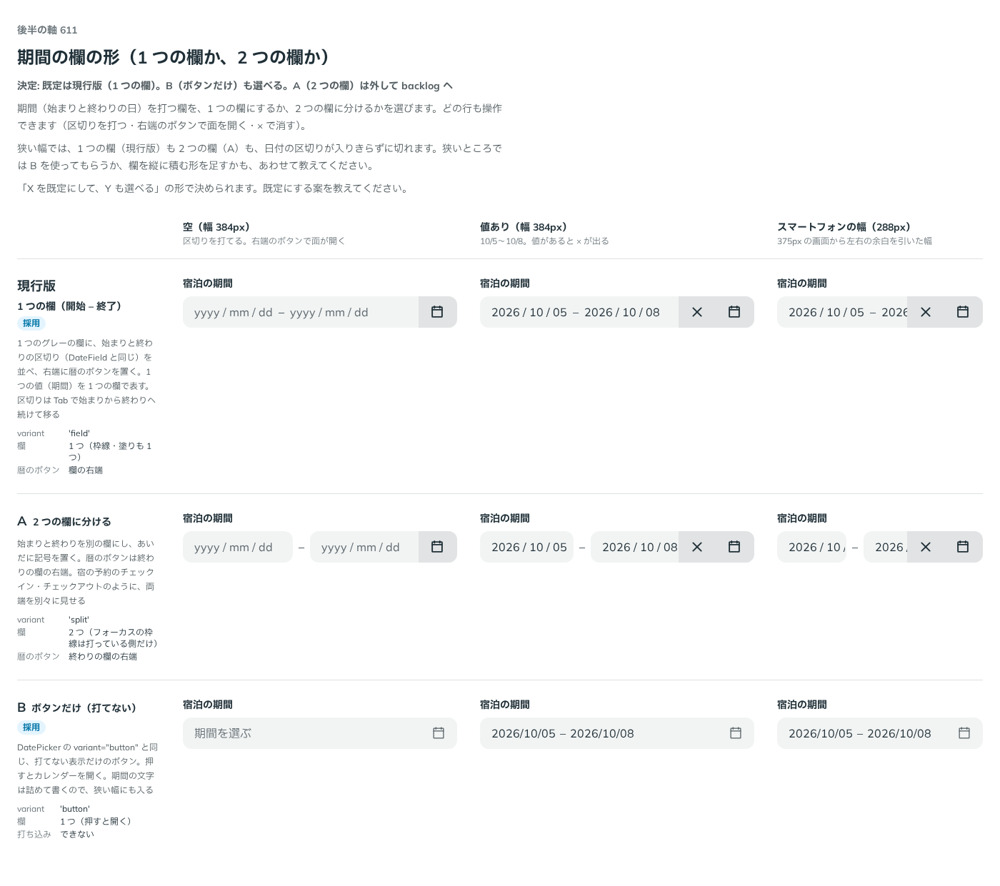

# 0503. DateRangePicker の欄は 1 つの欄が既定で、ボタンの形も選べる。2 つに分ける形は backlog

- ステータス: Accepted
- 日付: 2026-10-08
- ラウンド: 後半 軸 611

## 背景

期間（始まりと終わりの日）を打つ欄を、1 つの欄にするか、2 つの欄に分けるか、打てないボタンにするかを決める必要がありました。DatePicker には `variant`（`field`・`button`）があり、それとの関係も問われます。

## 候補

| 案             | 形                                                         |
| -------------- | ---------------------------------------------------------- |
| 現行版（採用） | 1 つの欄。始まりと終わりの区切りを並べ、右端に暦のボタン   |
| A              | 2 つの欄。あいだに記号を置き、暦のボタンは終わりの欄の右端 |
| B（採用）      | ボタンだけ（打てない）。押すとカレンダーを開く             |

## 決定

**1 つの欄（`variant="field"`）を既定にし、ボタン（`variant="button"`）も選べます。** 2 つの欄に分ける形（A）は部品から外して backlog に回します。

- 作った 2 つの欄の形のコードは main に残していません。見た目は比較画像にあります

## 理由

ユーザーの返事の原文です。

> デフォルトは現行で、ボタンの見た目も選べる、分割するバリエーションは backlog でお願いします。

以下は、決めたときの考えです。

- **1 つの値は 1 つの欄**: 期間は 1 つの値なので、1 つの欄に収まるほうが、DateField と同じ打ち方で扱えます
- **ボタンは狭い幅の逃げ道**: 期間の文字は詰めて書くので、狭い幅にも入ります。欄は狭いと日付の区切りが切れるため、ボタンの形を選べるようにしました
- **分割は急がない**: 宿の予約のように両端を別々に見せたい場面は、あとから形を足せます

## 却下した案と理由

- **A（2 つの欄）**: 部品の形を増やす前に、1 つの欄とボタンで足りるかを使って確かめたいため、backlog に回しました

## 影響

- `src/components/date-range-picker/DateRangePicker.tsx`: `variant` は `'field'`（既定）と `'button'` です。`split` は外しました
- backlog に、欄を 2 つに分ける形、狭い幅で欄の日付が切れること、終わりだけ打ったときの扱いを足しました

## 原則への反映

反映なし。

決めた時点のコミットは `1d31a798` です。

## 比較画像

