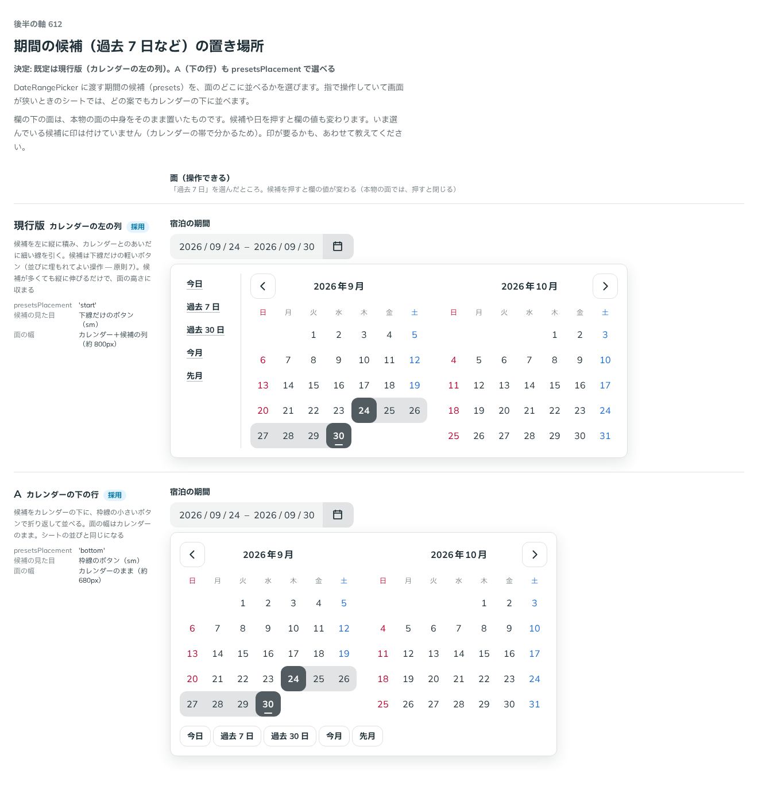

# 0504. DateRangePicker の期間の候補は、カレンダーの左の列が既定。下の行も選べる

- ステータス: Accepted
- 日付: 2026-10-08
- ラウンド: 後半 軸 612

## 背景

DateRangePicker には、期間の候補（過去 7 日など）を `presets` で渡せます。その候補を面のどこに並べるかを決める必要がありました。

## 候補

| 案             | 置き場所           | 候補の見た目           | 面の幅                           |
| -------------- | ------------------ | ---------------------- | -------------------------------- |
| 現行版（採用） | カレンダーの左の列 | 下線だけのボタン（sm） | カレンダー＋候補の列（約 800px） |
| A              | カレンダーの下の行 | 枠線のボタン（sm）     | カレンダーのまま（約 680px）     |

## 決定

**カレンダーの左の列（`presetsPlacement="start"`）を既定にし、下の行（`"bottom"`）も選べます。**

- 指で操作していて画面が狭いときのシートでは、どちらでもカレンダーの下に並べます
- 候補は、下線だけの軽いボタンです（並びに埋もれてよい操作 — 原則 7）

## 理由

ユーザーの返事の原文です。

> 現行既定、下も選べるで良さそう。

以下は、決めたときの考えです。

- **候補が多くても収まる**: 左の列は縦に伸びるだけで、面の高さに収まります
- **幅を抑えたい場面もある**: 下の行はカレンダーの幅のままで済み、シートの並びと同じです

## 却下した案と理由

- 既定にしない案（下の行）は、props で選べる形で残しました

## 影響

- `src/components/date-range-picker/DateRangePicker.tsx`: `presetsPlacement`（`'start'`・`'bottom'`、既定 `'start'`）を足しました
- `src/components/date-range-picker/date-range-picker.tokens.css`: 候補の列とカレンダーのあいだ、候補どうしのあいだのトークンを持ちます
- backlog に、いま選んでいる候補への印を足しました

## 原則への反映

反映なし。

決めた時点のコミットは `1d31a798` です。PR #164 を squash でマージしたので、このコミットは main にはありません。`git fetch origin pull/164/head` のあとで `git checkout 1d31a798 && pnpm storybook` を流すと、決めたときの部品のまま比較を開けます。

## 比較画像

