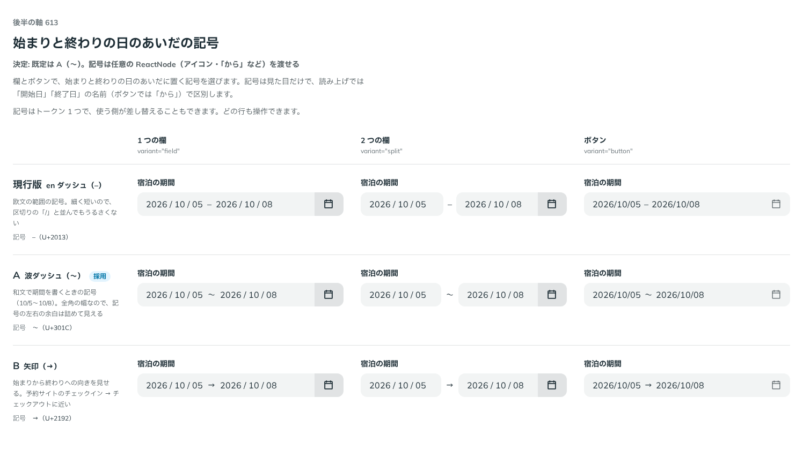

# 0505. DateRangePicker の始まりと終わりのあいだは「〜」が既定。separator に ReactNode を渡せる

- ステータス: Accepted
- 日付: 2026-10-08
- ラウンド: 後半 軸 613

## 背景

欄とボタンで、始まりと終わりの日のあいだに置く記号を決める必要がありました。

## 候補

| 案        | 記号             | 見え方                                                           |
| --------- | ---------------- | ---------------------------------------------------------------- |
| 現行版    | en ダッシュ（–） | 細く短く、区切りの「/」と並んでもうるさくない                    |
| A（採用） | 波ダッシュ（〜） | 和文で期間を書くときの記号。全角の幅で、左右の余白は詰めて見える |
| B         | 矢印（→）        | 始まりから終わりへの向きを見せる                                 |

## 決定

**A（〜）を既定にします。** `separator` に任意の ReactNode（アイコンや「から」など）を渡せます。

- 記号は見た目だけです。読み上げでは、欄では「開始日」「終了日」の名前で、ボタンでは `separatorName`（既定は「から」）で始まりと終わりを読み分けます
- 記号の左右の余白は、トークンの `--date-range-picker-separator-gap` です

## 理由

ユーザーの返事の原文です。

> Aがデフォルト、任意の ReactNode を設定できる、がよいですかね？（一文字じゃなく、アイコンや「から」にしたい可能性もありそう）

以下は、決めたときの考えです。

- **和文の期間の書き方に合う**: 10/5〜10/8 の形は、和文でふつうに見る書き方です
- **記号は文字とは限らない**: アイコンや「から」にしたい場面があるので、文字ではなく ReactNode を受けます

## 却下した案と理由

- **en ダッシュ（現行版）・矢印（B）**: 既定にはしません。`separator` に渡せば使えます

## 影響

- `src/components/date-range-picker/DateRangePicker.tsx`: `separator`（`ReactNode`、既定 `'〜'`）と `separatorName` を足しました。比べるための記号の切り替えは畳んで消しました

## 原則への反映

反映なし。

決めた時点のコミットは `1d31a798` です。PR #164 を squash でマージしたので、このコミットは main にはありません。`git fetch origin pull/164/head` のあとで `git checkout 1d31a798 && pnpm storybook` を流すと、決めたときの部品のまま比較を開けます。

## 比較画像

