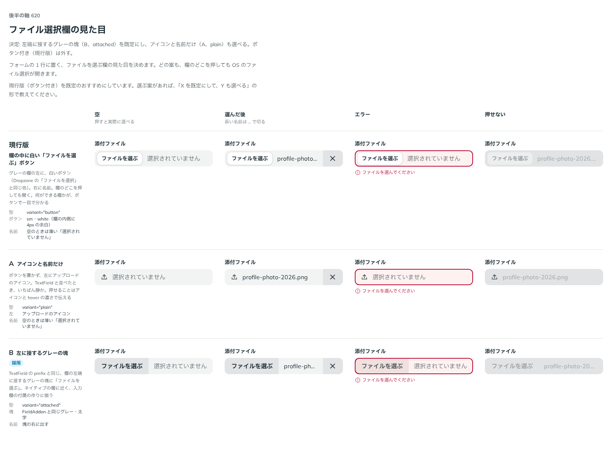

# 0506. FileInput の欄は、左端に接するグレーの塊が既定。アイコンと名前だけの形も選べる

- ステータス: Accepted
- 日付: 2026-10-08
- ラウンド: 後半 軸 620

## 背景

FileInput は、フォームの 1 行に置く、ファイルを選ぶ欄です。欄のどこを押しても OS のファイル選択が開きます。何ができる欄かを、どんな見た目で伝えるかを決める必要がありました。

## 候補

| 案        | 型         | 見た目                                                                                          |
| --------- | ---------- | ----------------------------------------------------------------------------------------------- |
| 現行版    | `button`   | グレーの欄の中に白い「ファイルを選ぶ」ボタン（Dropzone の「ファイルを選択」と同じ色）。右に名前 |
| A（採用） | `plain`    | ボタンを置かず、左にアップロードのアイコン。右に名前                                            |
| B（採用） | `attached` | 欄の左端に接するグレーの塊に「ファイルを選ぶ」。右に名前                                        |

## 決定

**B（`attached`）を既定にし、A（`plain`）も選べます。** ボタン付き（現行版）は外します。

- 塊は、TextField の prefix と同じ作りで、欄の左端に接したグレーの塊（太字）です。文言は `buttonText` で変えられます
- 名前が空のときは、薄い「選択されていません」を出します

## 理由

ユーザーの返事の原文です。

> Bがデフォルト、DatePicker のように A も選べる、かなと思いました。ちなみに、グレーの浮いたボタンではなく白にしているのはなぜですか？

ユーザーの質問への答えです。現行版の白いボタンは、Dropzone の「ファイルを選択」と同じ色にそろえたものでした。グレーの欄の中でボタンを目立たせるために、欄と違う白にしていました。B では塊を欄の一部として作るので、欄と同じグレーです。

以下は、決めたときの考えです。

- **入力欄の付属の作りにそろう**: prefix・suffix と同じ塊なので、TextField と並べても作りが同じです（原則 8）。ネイティブの欄にも近くなります
- **見た目を選べる**: アイコンと名前だけの A は TextField と並べたとき最も静かです。DatePicker の `variant` のように、見た目を選べるようにします

## 却下した案と理由

- **現行版（欄の中の白いボタン）**: 欄の中にボタンが浮いて見え、入力欄の付属の作りから外れるため、外します

## 影響

- `src/components/file-input/FileInput.tsx`: `variant`（`'attached'`・`'plain'`、既定 `'attached'`）と `buttonText`（既定「ファイルを選ぶ」）を持ちます
- backlog に、幅 300px 前後で名前が数文字まで切れること、`size="sm"` の見た目を足しました

## 原則への反映

反映なし。原則 8 の、欄の端に付く塊の文に収まります。

決めた時点のコミットは `81ae2e5e` です。

## 比較画像

