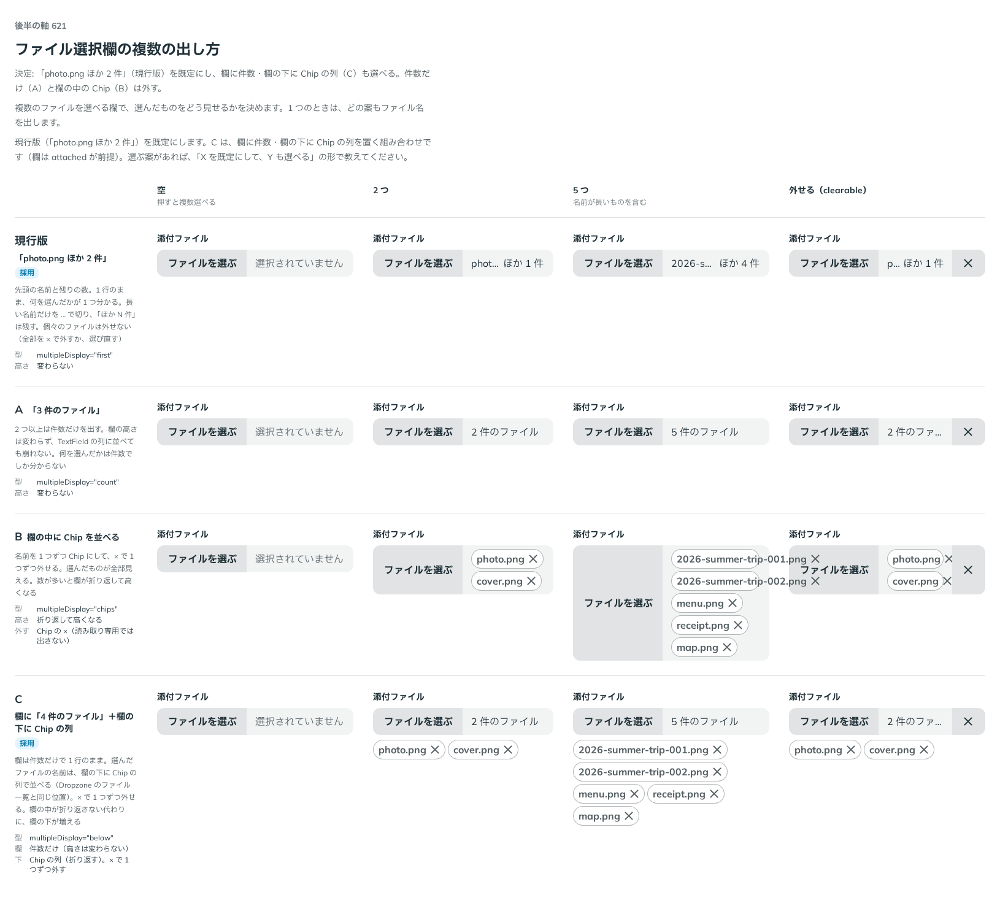

# 0507. FileInput の複数のファイルは「photo.png ほか 2 件」が既定。欄に件数と下の Chip の列も選べる

- ステータス: Accepted
- 日付: 2026-10-08
- ラウンド: 後半 軸 621

## 背景

複数のファイルを選べる欄で、選んだものをどう見せるかを決める必要がありました。欄を 1 行のままにするか、全部の名前を見せるかで、欄の高さと、1 つずつ外せるかが変わります。1 つのときは、どの案もファイル名を出します。

## 候補

| 案             | 欄                                           | 欄の下                                         |
| -------------- | -------------------------------------------- | ---------------------------------------------- |
| 現行版（採用） | 「photo.png ほか 2 件」                      | -                                              |
| A              | 「3 件のファイル」                           | -                                              |
| B              | 欄の中に Chip を並べる（数が多いと折り返す） | -                                              |
| C（採用）      | 「4 件のファイル」                           | Chip の列（Dropzone のファイル一覧と同じ位置） |

C は、1 回目の返事を受けて「欄に件数＋欄の下に Chip の列」を足した案です。

## 決定

**「photo.png ほか 2 件」（`multipleDisplay="first"`）を既定にし、C（`"below"`）も選べます。** 件数だけ（A）と、欄の中の Chip（B）は外します。

- `first` は、先頭の名前と残りの数を 1 行で出します。長い名前だけを … で切り、「ほか N 件」は残します
- `below` は、欄に件数だけを出し、欄の下に名前の Chip の列を置きます。× で 1 つずつ外せます。欄は `attached` が前提です

## 理由

ユーザーの返事の原文です。1 回目です。

> 複数選択できている場合、A のパターンをデフォルトとしつつ、Dropzone の見た目 + 現行 + Bを組み合わせるパターンも見たいです / ファイルを選ぶ 4件のファイル / image.png image2.png ...

2 回目の返事です。

> 現行デフォ、C も選べるで良さそう！

以下は、決めたときの考えです。

- **欄が増えても崩れない**: 1 行のままの `first` は、TextField の列に並べても高さが変わりません
- **外したいときは下の列**: 1 つずつ外したい場面は、Dropzone と同じ位置に Chip の列を置くほうが、見た目が一貫します

## 却下した案と理由

- **A（件数だけ）**: 何を選んだかが件数でしか分かりません
- **B（欄の中の Chip）**: 数が多いと欄が折り返して高くなり、TextField の列が崩れます

## 影響

- `src/components/file-input/FileInput.tsx`: `multipleDisplay`（`'first'`・`'below'`、既定 `'first'`）を足しました
- backlog に、欄の下の Chip の列と Field の下の文の間、拡張子を残す中間省略を足しました

## 原則への反映

反映なし。

決めた時点のコミットは `81ae2e5e` です。PR #164 を squash でマージしたので、このコミットは main にはありません。`git fetch origin pull/164/head` のあとで `git checkout 81ae2e5e && pnpm storybook` を流すと、決めたときの部品のまま比較を開けます。

## 比較画像

