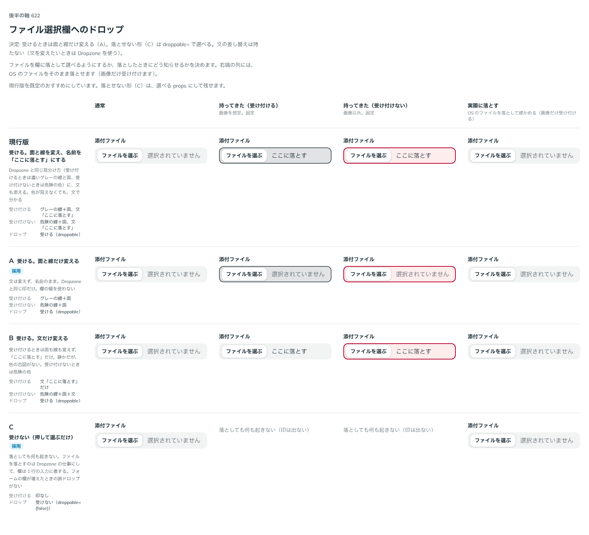

# 0508. FileInput は欄へのドロップを受け、面と線だけ変える。受けない形は droppable={false}

- ステータス: Accepted
- 日付: 2026-10-08
- ラウンド: 後半 軸 622

## 背景

ファイルを欄に落として選べるようにするか、落としたときにどう知らせるかを決める必要がありました。欄の幅は 1 行分しかなく、文を差し替える場所がありません。

## 候補

| 案        | 受け方                                                                                                    |
| --------- | --------------------------------------------------------------------------------------------------------- |
| A（採用） | 受ける。受け付けるときはグレーの線＋面、受け付けないときは危険の線＋面（Dropzone と同じ印）。文は変えない |
| C         | 受けない。落としても何も起きない。欄は 1 行の入力に徹する                                                 |

## 決定

**A にします。** 受けるときは面と線だけ変えます。受けない形（C）は `droppable={false}` で選べます。

- 文の差し替え（`dropText`）は持ちません。文を変えたいときは Dropzone を使います

## 理由

ユーザーの返事の原文です。

> A でいいかなと思いました。文言のカスタマイズをしたい場合、Dropzone を使ってね、になる気がします

以下は、決めたときの考えです。

- **ファイルを落とす仕事は Dropzone**: 文や案内を持つのは Dropzone です。FileInput は欄の幅を使わず、面と線だけで受けられることを伝えます
- **受けない形も残す**: フォームの欄が増えたときの誤ドロップを避けたい場面のために、`droppable={false}` を持ちます

## 却下した案と理由

- **C を既定にする案**: ファイルを落として選べる便利さを、既定では残すため採りません。props で選べる形で残しました

## 影響

- `src/components/file-input/FileInput.tsx`: `droppable`（既定 `true`）を足しました。ドラッグ中の色は、役割のトークンで直に書いています
- 判定とアップロードの矢印は `src/internal` に移し、Dropzone と共有します
- backlog に、実機のタップと読み上げソフトでの確かめを足しました

## 原則への反映

反映なし。

決めた時点のコミットは `81ae2e5e` です。

## 比較画像

