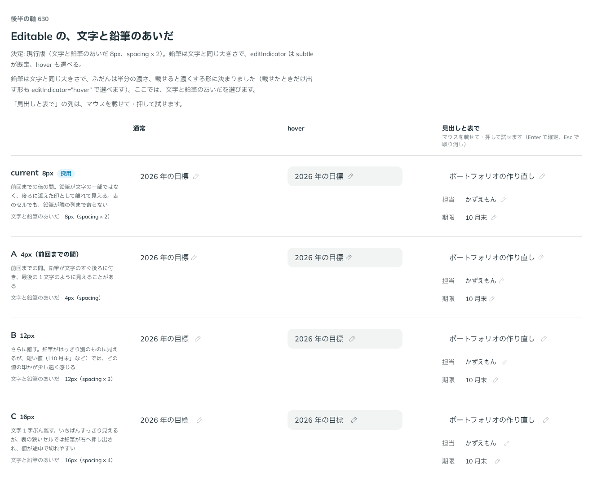

# 0509. Editable の文字のときは、文字と同じ大きさの鉛筆を 8px 離して添える。ふだんは半分の濃さで、載せると濃くする

- ステータス: Accepted
- 日付: 2026-10-08
- ラウンド: 後半 軸 630

## 背景

Editable は、ふだんは文字として見え、押すと入力欄になる部品です。文字のときに「押すと書き換えられる」ことを、どう見せるかを決める必要がありました。この軸は 3 回比べました。1 回目は印の形、2 回目は鉛筆の大きさと濃さ、3 回目は文字と鉛筆のあいだです。

## 候補

1 回目は印の形です。

| 案        | ふだん                   | hover                           |
| --------- | ------------------------ | ------------------------------- |
| 現行版    | 印なし                   | 入力欄のグレーの淡い面          |
| A         | 淡い破線の下線           | 破線を濃く                      |
| B（採用） | 鉛筆（半分の濃さ）       | グレーの面＋鉛筆を濃く          |
| C         | いつも入力欄のグレーの面 | 入力欄の hover と同じ半段濃い面 |

2 回目は、B の鉛筆の大きさと濃さです。

| 案                  | 大きさ                   | 濃さ                         |
| ------------------- | ------------------------ | ---------------------------- |
| 現行版              | 文字の 3/4               | ふだん半分、hover で濃く     |
| A（採用）           | 文字と同じ               | ふだん半分、hover で濃く     |
| B                   | 入力欄のアイコン（20px） | ふだん半分、hover で濃く     |
| C                   | 文字の 3/4               | ふだん 3 割、hover で濃く    |
| D（選べる形で採用） | 文字の 3/4               | ふだんは出さず、hover で出す |

3 回目は、文字と鉛筆のあいだです。

| 案             | あいだ |
| -------------- | ------ |
| 現行版（採用） | 8px    |
| A              | 4px    |
| B              | 12px   |
| C              | 16px   |

## 決定

**鉛筆は文字と同じ大きさで、文字から 8px 離して添えます。ふだんは半分の濃さで、載せる（hover）かキーボードで止まると濃くします（`editIndicator="subtle"`、既定）。** 載せたときだけ出す形（`editIndicator="hover"`）も選べます。

- hover では、入力欄のグレーの淡い面も文字の下に敷きます
- 指では載せられないので、`hover` の形でもいつも淡く出します

## 理由

ユーザーの返事の原文です。1 回目です。

> B にしつつ、鉛筆のサイズを調整すればうるさくないかなと思いました。軸内で調整したいです。

2 回目です。

> 文字と同じ大きさでホバー時に濃くしつつ、もう少し文字と余白をあけられますか？D のようなホバー時のみのオプションも付けたいです。

3 回目です。

> 現行で良さそう！

以下は、決めたときの考えです。

- **指でも気づける**: 指には hover がないので、ふだんから淡く印を置いておくと、押す前から書き換えられると分かります
- **鉛筆は文字と同じ大きさ**: アイコンを文字に合わせる決まり（原則 21）のとおりです
- **文字と離す**: 4px では文字の最後の 1 文字のように見えることがあります。8px なら後ろに添えた印として離れて見え、表のセルでも隣の列まで寄りません

## 却下した案と理由

- **現行版（1 回目: hover で淡い面だけ）**: 指では押すまで気づけません
- **A（淡い破線の下線）**: 鉛筆（B）が選ばれたため採りません
- **C（いつも淡い面）**: ふだんから TextField とほとんど同じに見え、文字として読ませる良さが薄れます
- **16px のあき**: 表の狭いセルで、鉛筆が右へ押し出され、値が途中で切れやすくなります

## 影響

- `src/components/editable/Editable.tsx`: `editIndicator`（`'subtle'`・`'hover'`、既定 `'subtle'`）を足しました
- `src/components/editable/editable.tokens.css`: ふだんの濃さ `--editable-cue-icon-subtle-opacity`（0.5）を持ちます。比べるためだけの切り替えは畳んで消しました
- backlog に、読み込み中の円と鉛筆のあいだを分けるか、周りの文字と左端をそろえるかなどを足しました

## 原則への反映

原則 8 に、ふだんは文字で押すと入力欄になるものの印の文を足しました。

決めた時点のコミットは `4a5198b2` です。PR #164 を squash でマージしたので、このコミットは main にはありません。`git fetch origin pull/164/head` のあとで `git checkout 4a5198b2 && pnpm storybook` を流すと、決めたときの部品のまま比較を開けます。

## 比較画像

