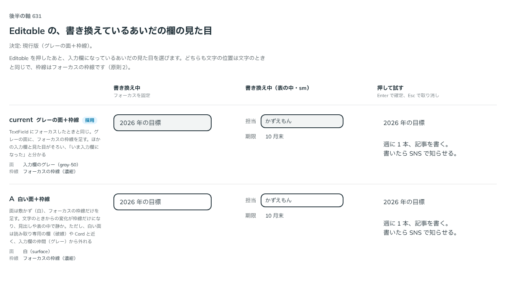

# 0510. Editable を書き換えているあいだの欄は、TextField にフォーカスしたときと同じ

- ステータス: Accepted
- 日付: 2026-10-08
- ラウンド: 後半 軸 631

## 背景

Editable を押したあと、入力欄になっているあいだの見た目を決める必要がありました。どちらの案も、文字の位置は文字のときと同じです。枠線はフォーカスの枠線です（原則 2）。

## 候補

| 案             | 面             | 枠線             |
| -------------- | -------------- | ---------------- |
| 現行版（採用） | 入力欄のグレー | フォーカスの枠線 |
| A              | 白（敷かない） | フォーカスの枠線 |

## 決定

**現行版にします。** グレーの面に、フォーカスの枠線を足します。TextField にフォーカスしたときと同じです。

## 理由

ユーザーの返事の原文です。

> 現行でお願いします。

以下は、決めたときの考えです。

- **入力欄の仲間に見える**: グレーの面があれば、「いま入力欄になった」と分かります（原則 8）
- **A は入力欄から外れる**: 白い面は、読み取り専用の欄（破線）や Card と近く、入力欄の仲間から外れます

## 却下した案と理由

- **A（白い面＋枠線）**: 見出しや表の中では静かですが、文字のときからの変化が枠線だけになり、入力欄の仲間のグレーから外れるため、採りません

## 影響

- 部品の変更はありません。入力欄の面の色を切り替えるためだけに足したトークンは、畳んで消しました

## 原則への反映

反映なし。原則 2 と原則 8 の範囲内です。

決めた時点のコミットは `4a5198b2` です。

## 比較画像

