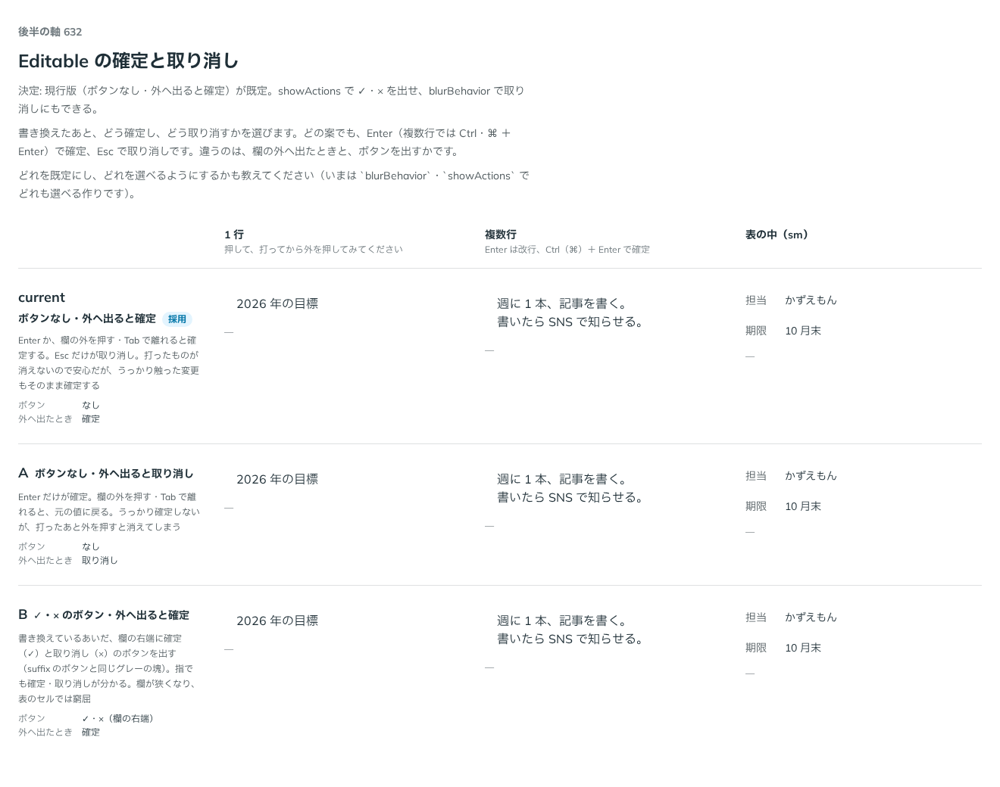

# 0511. Editable は、ボタンなしで外へ出ると確定するのが既定。showActions で ✓・× を出せる

- ステータス: Accepted
- 日付: 2026-10-08
- ラウンド: 後半 軸 632

## 背景

Editable を書き換えたあと、どう確定し、どう取り消すかを決める必要がありました。どの案でも、Enter（複数行では Ctrl・⌘＋Enter）で確定し、Esc で取り消します。違うのは、欄の外へ出たときの扱いと、ボタンを出すかです。

## 候補

| 案             | ボタン           | 外へ出たとき |
| -------------- | ---------------- | ------------ |
| 現行版（採用） | なし             | 確定         |
| A              | なし             | 取り消し     |
| B              | ✓・×（欄の右端） | 確定         |

## 決定

**ボタンなし・外へ出ると確定を既定にします。** `showActions` で ✓・× を欄の右端に出せ、`blurBehavior="cancel"` で外へ出たときの取り消しにもできます。保存は `onValueCommitted` のままです。`onValueChange` は、打つたびに呼びます。

## 理由

ユーザーの返事の原文です。

> デフォルトで、ボタンを任意で表示できる、で良さそうかなと

「Editable は今の設計で良さそうです」とも返事がありました。

以下は、決めたときの考えです。

- **打ったものが消えない**: 外へ出ても確定すれば、打ったものが消えず、安心です
- **ボタンは任意**: 指では確定・取り消しの場所が見えるほうが分かりやすい場面があります。欄が狭くなるので、既定にはしません
- **blurBehavior で取り消しも選べる**: うっかり触った変更を確定したくない場面のために残します

## 却下した案と理由

- **A（外へ出ると取り消し）**: 打ったあと外を押すと消えてしまいます。props で選べる形で残しました
- **B（✓・× を常に出す）**: 欄が狭くなり、表のセルでは窮屈です。props で選べる形で残しました

## 影響

- `src/components/editable/Editable.tsx`: `blurBehavior`（`'commit'`・`'cancel'`、既定 `'commit'`）と `showActions`（既定 `false`）を持ちます
- backlog に、確定を拒む形（検証）、ダブルクリックで始める形を足しました

## 原則への反映

反映なし。

決めた時点のコミットは `4a5198b2` です。

## 比較画像

