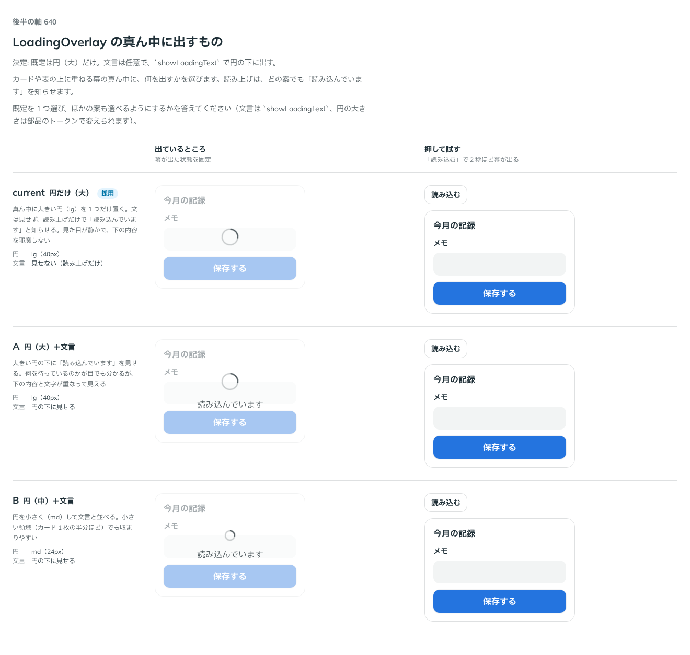

# 0512. LoadingOverlay の真ん中は、大きい円だけが既定。文言は showLoadingText で出す

- ステータス: Accepted
- 日付: 2026-10-08
- ラウンド: 後半 軸 640

## 背景

LoadingOverlay は、カードや表などの領域に幕を重ねて、読み込み中であることを伝える部品です。幕の真ん中に、何を出すかを決める必要がありました。読み上げは、どの案でも「読み込んでいます」を知らせます。

## 候補

| 案             | 円         | 文言                     |
| -------------- | ---------- | ------------------------ |
| 現行版（採用） | lg（40px） | 見せない（読み上げだけ） |
| A              | lg（40px） | 円の下に見せる           |
| B              | md（24px） | 円の下に見せる           |

## 決定

**大きい円（lg）だけを既定にします。** 文言は任意で、`showLoadingText` で円の下に出します。

- 文言は `loadingText`（既定「読み込んでいます」）です。読み上げは、`showLoadingText` によらず幕が出たときに知らせます

## 理由

ユーザーの返事の原文です。

> 文言は任意として、デフォルトは現行のサイズで良さそうです。

以下は、決めたときの考えです。

- **静かで、下の内容を邪魔しない**: 円だけなら、下の内容と文字が重なって見えません
- **円の大きさは軽いまま**: 面の真ん中の大きな円は、大きくなるのは円だけで、線は細いままです（原則 14）
- **文言は任意**: 何を待っているかを目でも伝えたい場面のために、出せるようにします

## 却下した案と理由

- **A・B（文言を既定で出す）**: 下の内容と文字が重なって見えます。props で出せる形で残しました

## 影響

- `src/components/loading-overlay/LoadingOverlay.tsx`: `showLoadingText`（既定 `false`）を足しました
- `src/components/loading-overlay/loading-overlay.tokens.css`: 円の大きさ・線の太さ（Spinner の lg と同じ）を持ちます
- backlog に、文言を小さい面に載せるか、円の大きさの段を props にするかを足しました

## 原則への反映

反映なし。原則 14 の、面の真ん中の大きな円の文に収まります。

決めた時点のコミットは `9fa2eb24` です。PR #164 を squash でマージしたので、このコミットは main にはありません。`git fetch origin pull/164/head` のあとで `git checkout 9fa2eb24 && pnpm storybook` を流すと、決めたときの部品のまま比較を開けます。

## 比較画像

