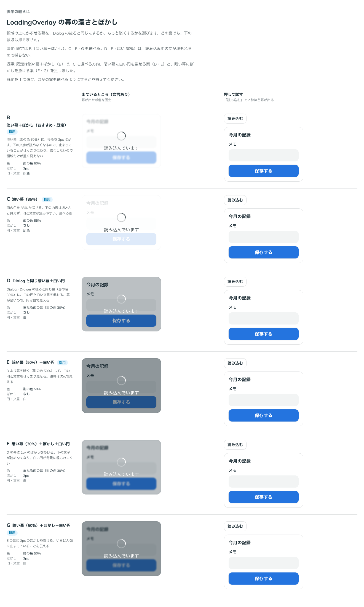

# 0513. LoadingOverlay の幕は、淡い面にぼかしが既定。濃い幕と、暗い幕（ぼかしあり・なし）も選べる

- ステータス: Accepted
- 日付: 2026-10-08
- ラウンド: 後半 軸 641

## 背景

領域にかぶせる幕の濃さとぼかしを決める必要がありました。Dialog の後ろと同じ暗い幕にするか、もっと淡くするかです。どの案でも、下の領域は押せません。この軸は 3 回比べました。返事のたびに、白い円を載せる暗い幕、ぼかしを掛けた暗い幕の案を足しました。

## 候補

| 案              | 色                         | ぼかし | 円・文言 |
| --------------- | -------------------------- | ------ | -------- |
| B（採用・既定） | 面の色 60%                 | 2px    | 灰色     |
| C（採用）       | 面の色 85%                 | なし   | 灰色     |
| D               | 重なる面の幕（影の色 30%） | なし   | 白       |
| E（採用）       | 影の色 50%                 | なし   | 白       |
| F               | 重なる面の幕（影の色 30%） | 2px    | 白       |
| G（採用）       | 影の色 50%                 | 2px    | 白       |

1 回目の比較には、Dialog と同じ暗い幕（A）もありました。

## 決定

**B（淡い幕＋ぼかし）を既定にし、C・E・G も選べます。** D・F は採りません。幕の色を `variant`（`'light'`・`'dark'`、既定 `'light'`）、ぼかしを `blur`（既定 true）で選び、4 案はこの組み合わせで表します。`variant` の語は、同じ意味の後ろの面を持つ ImageZoom・Gallery にそろえました。

| `variant`       | `blur`         | 案  |
| --------------- | -------------- | --- |
| `light`（既定） | `true`（既定） | B   |
| `light`         | `false`        | C   |
| `dark`          | `true`         | G   |
| `dark`          | `false`        | E   |

淡い幕でぼかさないときは、面の色を 85% まで濃くして下を隠します（C）。

## 理由

ユーザーの返事の原文です。1 回目です。

> デフォルト B で、C も選べる＋A で白いローディングにできたらいいかな？と思いました。ちょっと見てみたいです。

props の名前についての返事です。はじめ `variant` を `frosted`・`strong`・`dark`・`dark-frosted` の 4 値にしていました。

> loadingOverlay の variant の値はちょっと考えたいです。light, dark? かなと思いつつ、後は frosted があまりなじみがないので blur 都かも選択肢としてあるかなと

`variant`（light・dark）と `blur` に分ける案に、「別にするで良さそう。」

2 回目です。

> 黒でぼかしってどうですか？

3 回目です。

> E と G も選べる、がよさそうですね。黒30%だと読み込み中のテキストが埋もれちゃいますね。

以下は、決めたときの考えです。

- **淡い幕は領域だけを重くしない**: 面の色を透かして後ろをぼかすと、下の文字が読めなくなり、止まっていることが伝わります。暗くしないので、領域だけが重く見えません
- **暗い幕は 50% から**: 30% では、読み込み中の文が背景に埋もれます。50% なら、白い円と文言がはっきり見えます
- **場面で選ぶ**: 濃い幕は下をほとんど見せたくないとき、暗い幕は暗い面の上に載せるときに向きます

## 却下した案と理由

- **D・F（暗い幕 30%＋白い円）**: 読み込み中の文が埋もれるため、採りません

## 影響

- `src/components/loading-overlay/LoadingOverlay.tsx`: `variant`（`'light'`・`'dark'`、既定 `'light'`）と `blur`（既定 true）を足しました
- `src/components/loading-overlay/loading-overlay.tokens.css`: 幕の色（`--loading-overlay-bg`、`-bg-unblurred`、`-bg-dark`）とぼかし（`--loading-overlay-blur`）、円と文言の色（`--loading-overlay-fg`）を持ちます
- 比べるためだけの切り替えは、畳んで消しました

## 原則への反映

原則 14 に、領域に重ねる幕は暗くせず、後ろをぼかす文を足しました。

決めた時点のコミットは `9fa2eb24` です。

## 比較画像

