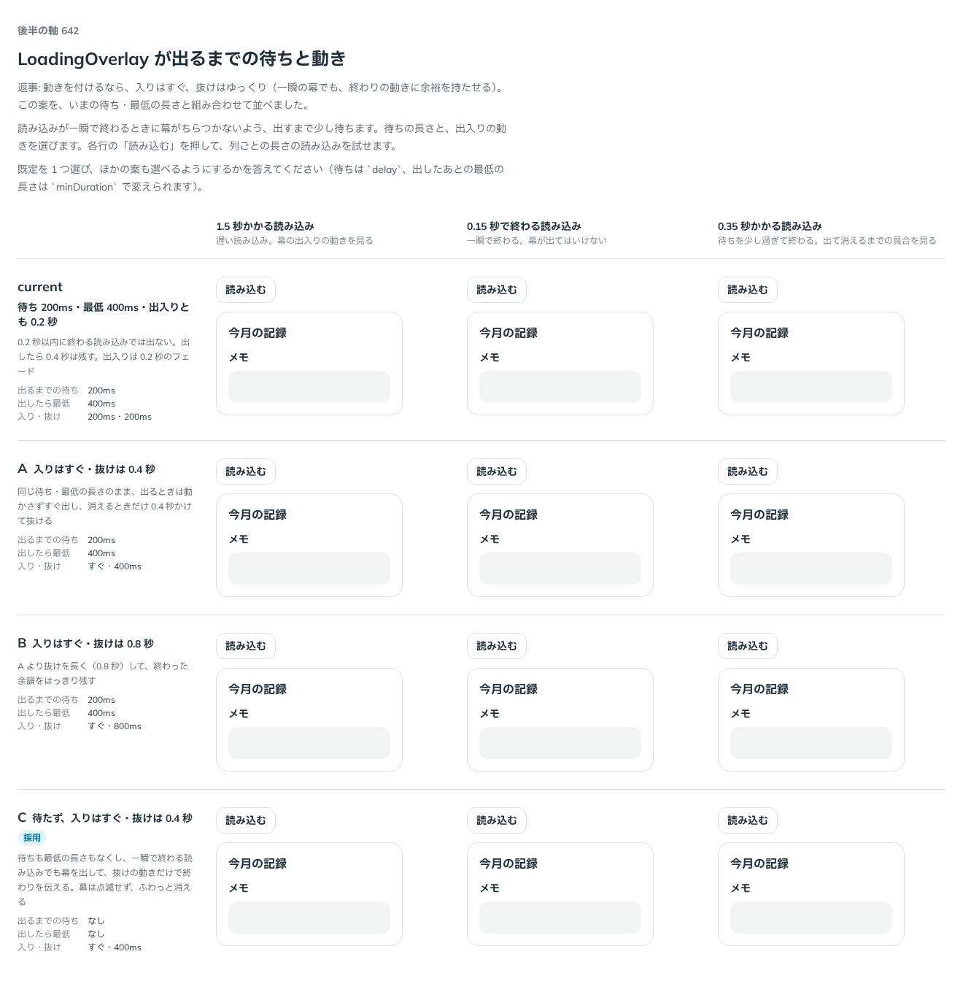

# 0514. LoadingOverlay は待たずにすぐ出て、抜けは 0.4 秒。待ち・最低の長さ・出入りの長さを props で渡せる

- ステータス: Accepted
- 日付: 2026-10-08
- ラウンド: 後半 軸 642

## 背景

読み込みが一瞬で終わるときに、幕がちらつかないようにするか、一瞬でも幕を出すかを決める必要がありました。出すまでの待ち（`delay`）、出したあとの最低の長さ（`minDuration`）、出入りの動きの長さの組み合わせです。

## 候補

| 案        | 出るまでの待ち | 出したら最低 | 入り・抜け   |
| --------- | -------------- | ------------ | ------------ |
| 現行版    | 200ms          | 400ms        | 200ms・200ms |
| A         | 200ms          | 400ms        | すぐ・400ms  |
| B         | 200ms          | 400ms        | すぐ・800ms  |
| C（採用） | なし           | なし         | すぐ・400ms  |

## 決定

**C にします。** 待たず、最低の長さもなく、入りはすぐ、抜けは 0.4 秒かけます。`delay`・`minDuration`・`enterDuration`・`exitDuration` を props で渡せます（ミリ秒。既定はそれぞれ 0・0・0・400）。

- 一瞬で終わる読み込みでも幕を出し、抜けの動きで終わりを伝えます。幕は点滅せず、ふわっと消えます
- 一瞬で終わる読み込みで幕を出したくないときは、`delay` に 200 ほどを渡します
- 動きを減らす設定では、ふわっと消える動きをなくし、すぐに消します

## 理由

ユーザーの返事の原文です。1 回目です。

> あえてアニメーションをつけるならば、入りは直ぐ、抜けはゆっくり（一瞬の幕の場合でも、完了アニメーションに余裕を持たせる）でいいかなと。見てみたいです。

2 回目です。

> デフォルトは C が良さそう。ユーザーが任意に設定できるようにしたいですね。

以下は、決めたときの考えです。

- **入りはすぐ**: 押したことへの返事は待たせません（原則 14）
- **抜けはゆっくり**: 終わりを動きで伝えると、一瞬の幕でも、終わったことが分かります
- **待ちは使う側が決める**: 読み込みの長さは場面によって違うので、props で渡せるようにします

## 却下した案と理由

- **現行版・A・B（200ms 待つ）**: 既定にはしません。`delay` と `minDuration` を渡せば再現できます

## 影響

- `src/components/loading-overlay/LoadingOverlay.tsx`: `delay`・`minDuration`・`enterDuration`・`exitDuration` を足しました
- `src/components/loading-overlay/loading-overlay.tokens.css`: 幕が出る長さ・消える長さのトークンと、入り・抜けのキーフレームを持ちます
- backlog に、delay のあいだの二重押し、縦に長い領域での円の位置、fullscreen のときのフォーカス・スクロールを足しました

## 原則への反映

原則 14 に、領域に重ねる幕の出入りの文を足しました。

決めた時点のコミットは `9fa2eb24` です。PR #164 を squash でマージしたので、このコミットは main にはありません。`git fetch origin pull/164/head` のあとで `git checkout 9fa2eb24 && pnpm storybook` を流すと、決めたときの部品のまま比較を開けます。

## 比較画像

